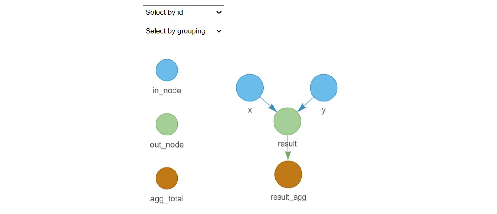

# mcmodule 

Framework for building modular Monte Carlo risk analysis models. It extends the capabilities of `mc2d` to facilitate working with multiple risk pathways, variates and scenarios. The package includes tools for creating stochastic objects from data frames, visualising results, and performing uncertainty, sensitivity and convergence analysis.

## Installation

Install from CRAN:

``` r
install.packages("mcmodule")
library("mcmodule")
```

Install latest development version from GitHub (requires `devtool` package)

``` r
# install.packages("devtools")
devtools::install_github("NataliaCiria/mcmodule")
```

## Set up an mcmodel

1.  Create a data frame with input parameter

    ```{r}
    example_data  <- data.frame(
      category_1 = c("a", "b", "a", "b"),      # Category 1 (e.g., type)
      category_2 = c("blue", "blue", "red", "red"), # Category 2 (e.g., group)
      x_min = c(0.07, 0.3, 0.2, 0.5),          # Minimum value for parameter x
      x_max = c(0.08, 0.4, 0.3, 0.6),          # Maximum value for parameter x
      y = c(0.01, 0.02, 0.03, 0.04)            # Value for parameter y
    )
    ```

2.  Define the keys that uniquely identify each row in your data

    ```{r}
    example_data_keys <- list(
      example_data = list(
        cols = names(example_data),             # All columns in the data
        keys = c("category_1", "category_2")   # Unique identifiers for each row
      )
    )
    ```

3.  Define Monte Carlo node table (mctable) indicating how to build the stochastic nodes (you can use this csv template)

    ```{r}
    example_mctable <- data.frame(
      mcnode = c("x", "y"),                    # Names of the nodes
      description = c("Probability x", "Probability y"), # Descriptions
      mc_func = c("runif", NA),                # Distribution function for x, none for y
      from_variable = c(NA, NA),               # Source variable (not used here)
      transformation = c(NA, NA),              # Transformation (not used here)
      sensi_analysis = c(FALSE, FALSE)         # Include in sensitivity analysis
    )
    ```

4.  Write model expression indicating how to combine the parameters

    ```{r}
    example_exp <- quote({
      result <- x * y                     # Calculate result as product of x and y
    })
    ```

5.  Build the mcmodule with `eval_module()`, creating the stochastic nodes and evaluating the expression

    ```{r}
    example_mcmodule <- eval_module(
      exp = c(example = example_exp),          # Model expression(s)
      data = example_data,                     # Input data
      mctable = example_mctable,               # Node definitions
      data_keys = example_data_keys            # Data keys for matching
    )
    ```

6.  Once you have created a mcmodule object, you can use other package functions to summarize and visualize mcnodes, calculate totals, and combine them with other mcmodules

    ```{r}
    # Summarize the 'result' node
    mc_summary(example_mcmodule, "result")

    # Get 'result' aggregated by category 1
    example_mcmodule<-example_mcmodule%>%
      agg_totals(
        mc_name = "result",
        agg_keys = c("category_1")
      )

    # Print aggregated 'result'
    example_mcmodule$node_list$result_agg$summary

    # Visualize the mcmodule
    mc_network(example_mcmodule, legend = TRUE)
    ```



Further documentation and examples can be found in the [vignette](https://nataliaciria.github.io/mcmodule/articles/mcmodule.html) and in the [introduction](https://nataliaciria.github.io/mcmodule/articles/intro.html) article.

## Citations

If you use `mcmodule` in your research, please cite:

Ciria, N. (2024). mcmodule: Modular Monte Carlo Risk Analysis. R package version 1.0.0. <https://github.com/NataliaCiria/mcmodule>
