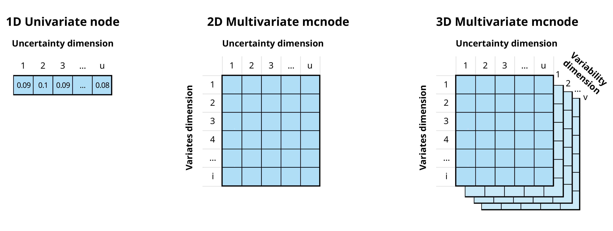
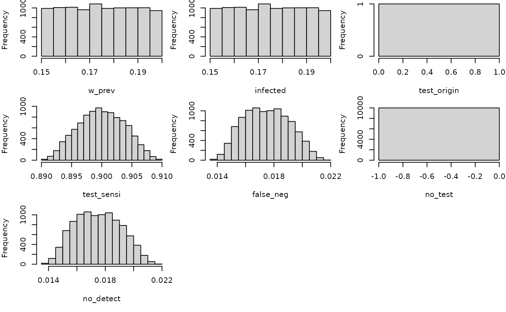
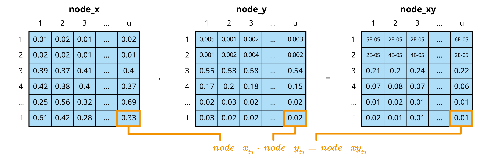
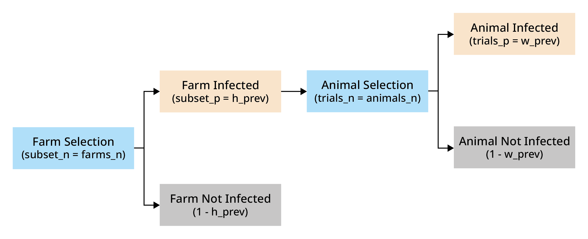

# mcmodule

## Introduction

`mcmodule` is a framework for building modular Monte Carlo risk analysis
models. It extends the capabilities of `mc2d` to make working with
multiple risk pathways, variates, and scenarios easier. It was developed
by epidemiologists, for the
[farmrisk](https://github.com/VetEpi-UAB/farmrisk) project, and now it
aims to help epidemiologists and other risk modellers save time and
evaluate ambitious, complex risk pathways in R.

The `mc2d` R package ([Pouillot and Delignette-Muller 2010](#ref-mc2d))
provides tools to build and analyse models involving multiple variables
and uncertainties based on Monte Carlo simulations. The `mcmodule`
package includes additional tools to:

1.  Organize risk analysis in independent flexible modules
2.  Perform multivariate mcnode operations
3.  Automate the creation of mcnodes
4.  Visualize risk analysis models

### Multivariate Monte-Carlo simulations

Quantitative risk analysis is the numerical assessment of risk to
facilitate decision making in the face of uncertainty. Monte Carlo
simulation is a technique used to model and analyse uncertainty ([Vose
2008](#ref-Vose2008)).

In `mc2d`, parameters are stored as **mcnode** class objects. These
objects are arrays of numbers that represent random variables and have
three dimensions: **variability × uncertainty × variates**. For more
information, see the [mc2d](https://CRAN.R-project.org/package=mc2d)
package vignette.



In the `mcmodule` framework an mcnode is an array of **dimensions (*u* ×
1 × *i*)**:

- We combine **variability** and **uncertainty** into one
  dimension[¹](#fn1) (***u***)

- We use **variates** (representing different groups or categories) in
  the other dimension (***i***)

- The variables that define and distinguish these variates are called
  **keys** and are stored as metadata

In this document we will use the term “uncertainty dimension” to refer
to the combined dimension of variability and uncertainty.

> **Example**
>
> If we are buying a number of cows and heifers from a specific region,
> an mcnode for herd prevalence would have:
>
> - Multiple variates (rows), defined by two keys: “animal category” and
>   “pathogen”
>
> - Probability values generated through a PERT distribution, using
>   minimum, mode, and maximum parameters across *u* iterations
>   (columns) to model the uncertainty in these estimates
>
> 
>
> *An mcnode representing herd prevalence of three pathogens,
> tuberculosis (TB), infectious bovine rhinotracheitis (IBR), and bovine
> viral diarrhoea (BVD), and two animal categories (cows and heifers).
> The herd prevalence is the same for both animal categories, but values
> differ due to the stochastic nature of random sampling from the PERT
> distribution.*

### Risk assessment

This section provides a brief introduction to risk assessment in R.
Although this package is not intended for beginners in risk assessment,
it can help you understand the logic behind `mcmodule` and its purpose.

#### A simple risk assessment

Consider a scenario where we need to purchase a cow from a farm that we
know is infected with a disease our farm is free from. To reduce the
risk of introducing the disease to our farm, we plan to perform a
diagnostic test on the cow before bringing it to our farm. We want to
calculate the probability of introducing the disease by purchasing one
cow that tests negative.

We have an estimation (with some uncertainty) of both the probability of
animal infection within a herd and the test sensitivity, so we want to
conduct a **stochastic** risk assessment that properly accounts for this
**uncertainty**.

The risk assessment for our cattle purchase can be performed using base
R ([2024](#ref-base)) random sampling functions, or `mc2d` ([Pouillot
and Delignette-Muller 2010](#ref-mc2d)), a package provides additional
probability distributions (such as `rpert`) and other useful tools for
analysing stochastic (Monte-Carlo) simulations.

``` r
library(mc2d)
set.seed(123)
n_iterations <- 10000

# Within-herd prevalence
w_prev <- mcstoc(runif,
  min = 0.15, max = 0.2,
  nsu = n_iterations, type = "U"
)
# Test sensitivity
test_sensi <- mcstoc(rpert,
  min = 0.89, mode = 0.9, max = 0.91,
  nsu = n_iterations, type = "U"
)
# Probability an animal is tested in origin
test_origin <- mcdata(1, type = "0") # Yes


# EXPRESSIONS
# Probability that an animal in an infected herd is infected (a = animal)
infected <- w_prev
# Probability an animal is tested and is a false negative
# (test specificity assumed to be 100%)
false_neg <- infected * test_origin * (1 - test_sensi)
# Probability an animal is not tested
no_test <- infected * (1 - test_origin)
# Probability an animal is not detected
no_detect <- false_neg + no_test

mc_model <- mc(
  w_prev, infected, test_origin, test_sensi,
  false_neg, no_test, no_detect
)

# RESULT
hist(mc_model)
```



``` r
no_detect
#>   node    mode nsv   nsu nva variate    min   mean median    max Nas type outm
#> 1    x numeric   1 10000   1       1 0.0138 0.0175 0.0174 0.0218   0    U each
```

#### Multiple risk assessments at once

In the previous example, we calculated the risk for one specific case.
However, we know that this farm is also positive for pathogen B, so it
would be also interesting to calculate the risk of introducing it as
well. Pathogen B has different within-herd prevalence and test
sensitivity than Pathogen A.

To estimate the risk for both pathogens with our previous models, we
could:

- Copy and paste the code twice with different parameters (against all
  good coding practices)

- Wrap the code in a function and call it twice using each pathogen’s
  parameters as arguments

- Create a loop

While these options work, they become messy or computationally intensive
when the number of parameters or different situations to simulate
increases.

The package `mc2d` offers a clever solution to this scalability problem:
variates. In the previous example, our stochastic nodes only had
uncertainty dimension. However, we can now use the **variates**
dimension to calculate the risk of introduction of both pathogens at the
same time.

``` r
set.seed(123)
n_iterations <- 10000

# Within-herd prevalence
w_prev_min <- mcdata(c(a = 0.15, b = 0.45), nvariates = 2, type = "0")
w_prev_max <- mcdata(c(a = 0.2, b = 0.6), nvariates = 2, type = "0")

w_prev <- mcstoc(runif,
  min = w_prev_min, max = w_prev_max,
  nsu = n_iterations, nvariates = 2, type = "U"
)

# Test sensitivity
test_sensi_min <- mcdata(c(a = 0.89, b = 0.80), nvariates = 2, type = "0")
test_sensi_mode <- mcdata(c(a = 0.9, b = 0.85), nvariates = 2, type = "0")
test_sensi_max <- mcdata(c(a = 0.91, b = 0.90), nvariates = 2, type = "0")

test_sensi <- mcstoc(rpert,
  min = test_sensi_min,
  mode = test_sensi_mode, max = test_sensi_max,
  nsu = n_iterations, nvariates = 2, type = "U"
)

# Probability an animal is tested in origin
test_origin <- mcdata(c(a = 1, b = 1), nvariates = 2, type = "0")


# EXPRESSIONS
# Probability that an animal in an infected herd is infected (a = animal)
infected <- w_prev
# Probability an animal is tested and is a false negative
# (test specificity assumed to be 100%)
false_neg <- infected * test_origin * (1 - test_sensi)
# Probability an animal is not tested
no_test <- infected * (1 - test_origin)
# Probability an animal is not detected
no_detect <- false_neg + no_test

mc_model <- mc(
  w_prev, infected, test_origin, test_sensi,
  false_neg, no_test, no_detect
)

# RESULT
no_detect
#>   node    mode nsv   nsu nva variate    min   mean median    max Nas type outm
#> 1    x numeric   1 10000   2       1 0.0139 0.0175 0.0174 0.0217   0    U each
#> 2    x numeric   1 10000   2       2 0.0477 0.0787 0.0783 0.1178   0    U each
```

### When to use mcmodule?

The `mc2d` multivariate approach works well for basic multivariate risk
analysis. However, if instead of purchasing one cow, you’re dealing with
multiple cattle purchases, from different farms, across different
pathogens, scenarios, and age categories, or modelling multiple risk
pathways with different what-if scenarios, this approach becomes
unwieldy.

`mcmodule` addresses these challenges by providing functions for
**multivariate operations** and **modular management** of the risk
model. It automates the process of creating mcnodes and assigns metadata
to them (making it easy to identify which variate corresponds to which
data row). Thanks to this mcnode metadata, it enables row-matching
between nodes with different variates, combines probabilities across
variates, and calculates multilevel trials. As your risk analysis grows,
you can create separate modules for different pathways, each with
independent parameters, expressions, and scenarios that can later be
connected into a complete model.

This package is particularly useful for:

- **Working with complex models** that involve multiple pathways,
  pathogens, or scenarios simultaneously

- **Dealing with large parameter sets** (hundreds or thousands of
  parameters)

- **Handling different numbers of variates** across different parts of
  your model that need to be combined

- **Creating modular risk assessments** where different components need
  to be developed independently but later integrated (for example in
  collaborative projects)

- **Performing sophisticated sensitivity analyses** across multiple
  model components

However, for simpler analyses, such as single pathway models,
exploratory work, small models with few parameters, one-off analyses or
learning risk assessment `mcmodule`’s additional structure may be
unnecessary.

### Installing mcmodule

Now, let’s explore the package! We can install it from CRAN:

``` r
install.packages("mcmodule")
library("mcmodule")
```

Or install latest development version from GitHub (requires `devtool`
package):

``` r
# install.packages("devtools")
devtools::install_github("NataliaCiria/mcmodule")
library("mcmodule")
```

Other recommended packages to load along with mcmodule are:

``` r
# install.packages(c("dplyr","ggplot2","igraph","visNetwork"))
library(dplyr) # Data manipulation
library(igraph) # Network analysis
library(visNetwork) # Interactive network visualization
```

## Building an mcmodule

To quickly understand the key components of an mcmodule, we’ll start by
building one using the animal imports example included in the package.

### Data

Let’s consider a scenario where we want to evaluate the risk of
introducing pathogen A and pathogen B into our region from animal
imports from different regions (north, south, east, and west). We have
gathered the following data:

- `animal_imports`: number of animal imports with their mean and
  standard deviation values per region, and the number of exporting
  farms in each region.

  ``` r
  animal_imports
  #>   origin farms_n animals_n_mean animals_n_sd
  #> 1   nord       5            100            6
  #> 2  south      10            130           10
  #> 3   east       7            140           12
  ```

- `prevalence_region`: estimates for both herd and within-herd
  prevalence ranges for pathogens A and B, as well as an indicator of
  how often tests are performed in origin

  ``` r
  prevalence_region
  #>   pathogen origin h_prev_min h_prev_max w_prev_min w_prev_max test_origin
  #> 1        a   nord       0.08       0.10       0.15        0.2   sometimes
  #> 2        a  south       0.02       0.05       0.15        0.2   sometimes
  #> 3        a   east       0.10       0.15       0.15        0.2       never
  #> 4        b   nord       0.50       0.70       0.45        0.6      always
  #> 5        b  south       0.25       0.30       0.37        0.4   sometimes
  #> 6        b   east       0.30       0.50       0.45        0.6     unknown
  ```

- `test_sensitivity`: estimates of test sensitivity values for pathogen
  A and B

  ``` r
  test_sensitivity
  #>   pathogen test_sensi_min test_sensi_mode test_sensi_max
  #> 1        a           0.89            0.90           0.91
  #> 2        b           0.80            0.85           0.90
  ```

Now we will use
[`dplyr::left_join()`](https://dplyr.tidyverse.org/reference/mutate-joins.html)
to create our imports module data:

``` r
imports_data <- prevalence_region %>%
  left_join(animal_imports) %>%
  left_join(test_sensitivity) %>%
  relocate(pathogen, origin, test_origin)
#> Joining with `by = join_by(origin)`
#> Joining with `by = join_by(pathogen)`
```

### Data keys

From now on we will use only the merged `imports_data` table. However,
it is useful to understand which input dataset each parameter comes
from, as each dataset provides information for different keys. In this
context, keys are fields that (combined) uniquely identify each row in a
table. In our example:

- `animal_imports` provided information by region of `"origin"`

- `prevalence_region` provided information by `"pathogen"` and region of
  `"origin"`

- `test_sensitivity` provided information by `"pathogen"` only

The resulting merged table, `imports_data`, will therefore have two
keys: `"pathogen"` and `"origin"`. However, not all parameters will use
both keys, for example, `"test_sensi"` only has information by
`"pathogen"`. Knowing the keys for each parameter is crucial when
performing multivariate operations, such as [calculating
totals](https://nataliaciria.github.io/mcmodule/articles/intro.html#calculating-totals).

To make these relationships explicit in the model, we need to provide
the data keys. These are defined in a list with one element for each
input dataset, specifying both the columns and the keys for each
dataset.

``` r
imports_data_keys <- list(
  animal_imports = list(
    cols = names(animal_imports),
    keys = "origin"
  ),
  prevalence_region = list(
    cols = names(prevalence_region),
    keys = c("pathogen", "origin")
  ),
  test_sensitivity = list(
    cols = names(test_sensitivity),
    keys = "pathogen"
  )
)
```

### mcnodes table

With values and keys established, we still need some information to
build our stochastic parameters. The mcnode table specifies how to build
mcnodes from the data table. It specifies which parameters are included
in the model, the type of parameters (those with an mc_func are
stochastic), and what columns to look for in the data table to build
these mcnodes (the name of the mcnode, or another variable in the data
columns), as well as transformations that are useful to encode
categorical data values into mcnodes that must always be numeric.

- mcnode: Name of the Monte Carlo node (required)

- description: Description of the parameter

- mc_func: Probability distribution

- from_variable: Column name, if it comes from a column with a name
  different to the mcnode

- transformation: Transformation to be applied to the original column
  values

- sensi_analysis: Whether to include in sensitivity analysis[²](#fn2)

Here we have the `imports_mctable` for our example. While the mctable
can be hard-coded in R, it’s more efficient to prepare it in a CSV or
other external file. This approach also allows the table to be included
as part of the model documentation.

| mcnode          | description                                                                | mc_func | from_variable | transformation                                                                                   | sensi_analysis |
|:----------------|:---------------------------------------------------------------------------|:--------|:--------------|:-------------------------------------------------------------------------------------------------|:---------------|
| h_prev          | Herd prevalence                                                            | runif   | NA            | NA                                                                                               | TRUE           |
| w_prev          | Within herd prevalence                                                     | runif   | NA            | NA                                                                                               | TRUE           |
| test_sensi      | Test sensitivity                                                           | rpert   | NA            | NA                                                                                               | TRUE           |
| farms_n         | Number of farms exporting animals                                          | NA      | NA            | NA                                                                                               | FALSE          |
| animals_n       | Number of animals exported per farm                                        | rnorm   | NA            | NA                                                                                               | FALSE          |
| test_origin_unk | Unknown probability of the animals being tested in origin (true = unknown) | NA      | test_origin   | value==“unknown”                                                                                 | FALSE          |
| test_origin     | Probability of the animals being tested in origin                          | NA      | NA            | ifelse(value == “always”, 1, ifelse(value == “sometimes”, 0.5, ifelse(value == “never”, 0, NA))) | FALSE          |

The data table and the mctable must complement each other:

- mcnodes without an `mc_func` (like `farms_n`), needs the matching
  column name (`"farms_n"`) in the data table

- mcnodes with an `mc_func`, you need **columns for each probability
  distribution argument in the** **data table**. For example:

  - `h_prev` with `runif` distribution requires `"h_prev_min"` and
    `"h_prev_max"`

  - `animals_n` with `rnorm` distribution requires `"animals_n_mean"`
    and `"animals_n_sd"`

For encoding categorical variables as mcnodes (or any other data
transformation), you can use any R code with `value` as a placeholder
for the mcnode name or column name (specified in `from_variable`)

### Expressions

Finally, we need to write the model’s mathematical expression. These
expressions should ideally include only arithmetic operations, not R
functions (with some exceptions that will be covered later in “[tricks
and
tweaks](https://nataliaciria.github.io/mcmodule/articles/intro.html#tricks-and-tweaks)”).
We’ll wrap them using
[`quote()`](https://rdrr.io/r/base/substitute.html) so they aren’t
executed immediately but stored for later evaluation with
`eval_model()`.

``` r
imports_exp <- quote({
  # Probability that an animal in an infected herd is infected (a = animal)
  infected <- w_prev
  # Probability an animal is tested and is a false negative
  # (test specificity assumed to be 100%)
  false_neg <- infected * test_origin * (1 - test_sensi)
  # Probability an animal is not tested
  no_test <- infected * (1 - test_origin)
  # Probability an animal is not detected
  no_detect <- false_neg + no_test
})
```

### Evaluating an mcmodule

With all components in place, we’re now ready to create our first
mcmodule using
[`eval_module()`](https://nataliaciria.github.io/mcmodule/reference/eval_module.md).

``` r
imports <- eval_module(
  exp = c(imports = imports_exp),
  data = imports_data,
  mctable = imports_mctable,
  data_keys = imports_data_keys
)
#> imports evaluated
#> mcmodule created (expressions: imports)
```

``` r
class(imports)
#> [1] "mcmodule"
```

An mcmodule is an S3 object class, and it is essentially a list that
contains all risk assessment components in a structured format.

``` r
names(imports)
#> [1] "data"      "exp"       "node_list" "modules"
```

The mcmodule contains the input `data` and mathematical expressions
(`exp`) that ensure traceability. All input and calculated parameters
are stored in `node_list`. Each node contains not only the mcnode itself
but also important metadata: node type (input or output), source dataset
and columns, keys, calculation method, and more. The specific metadata
varies depending on the node’s characteristics. Here are a few examples:

``` r
imports$node_list$w_prev
#> $type
#> [1] "in_node"
#> 
#> $mc_func
#> [1] "runif"
#> 
#> $description
#> [1] "Within herd prevalence"
#> 
#> $inputs_col
#> [1] "w_prev_min" "w_prev_max"
#> 
#> $input_dataset
#> [1] "prevalence_region"
#> 
#> $keys
#> [1] "pathogen" "origin"  
#> 
#> $module
#> [1] "imports"
#> 
#> $mc_name
#> [1] "w_prev"
#> 
#> $mcnode
#>   node    mode  nsv nsu nva variate  min  mean median max Nas type outm
#> 1    x numeric 1001   1   6       1 0.15 0.175  0.175 0.2   0    V each
#> 2    x numeric 1001   1   6       2 0.15 0.175  0.173 0.2   0    V each
#> 3    x numeric 1001   1   6       3 0.15 0.176  0.176 0.2   0    V each
#> 4    x numeric 1001   1   6       4 0.45 0.524  0.524 0.6   0    V each
#> 5    x numeric 1001   1   6       5 0.37 0.385  0.385 0.4   0    V each
#> 6    x numeric 1001   1   6       6 0.45 0.525  0.525 0.6   0    V each
#> 
#> $data_name
#> [1] "imports_data"
imports$node_list$no_detect
#> $node_exp
#> [1] "false_neg + no_test"
#> 
#> $type
#> [1] "out_node"
#> 
#> $inputs
#> [1] "false_neg" "no_test"  
#> 
#> $module
#> [1] "imports"
#> 
#> $mc_name
#> [1] "no_detect"
#> 
#> $keys
#> [1] "pathogen" "origin"  
#> 
#> $param
#> [1] "false_neg" "no_test"  
#> 
#> $mcnode
#>   node    mode  nsv nsu nva variate    min   mean median   max Nas type outm
#> 1    x numeric 1001   1   6       1 0.0823 0.0961 0.0962 0.111   0    V each
#> 2    x numeric 1001   1   6       2 0.0821 0.0960 0.0954 0.110   0    V each
#> 3    x numeric 1001   1   6       3 0.1501 0.1758 0.1758 0.200   0    V each
#> 4    x numeric 1001   1   6       4 0.0473 0.0789 0.0783 0.113   0    V each
#> 5    x numeric 1001   1   6       5 0.2056 0.2216 0.2216 0.237   0    V each
#> 6    x numeric 1001   1   6       6 0.4501 0.5250 0.5251 0.600   0    V each
#> 
#> $data_name
#> [1] "imports_data"
```

And now that we have an mcmodule, we can begin exploring its
possibilities!

### Understanding mcnodes operations

When arithmetic operations are performed between nodes in mcmodule, they
are applied on matching elements and keep the original dimensions,
allowing uncertainties and variates to propagate through the
calculations.



## Working with an mcmodule

### Visualizing

We can visualize an mc_module with the
[`mc_network()`](https://nataliaciria.github.io/mcmodule/reference/mc_network.md)
function. For this, you will need to have `igraph` ([Csardi and Nepusz
2006](#ref-igraph)) and `visNetwork` ([Almende B. V. and Benoit
Thieurmel 2025](#ref-visnetwork)) installed.

In these network visualizations, input datasets appear in blue, input
data files, input columns and input mcnodes appear in different shades
of dark-grey-blue, output mcnodes in green, and total mcnodes (as we
will see later) in orange. The numbers displayed when clicked correspond
to the median and the 95% confidence interval of the first variate of
each mcnode.

``` r
mc_network(imports, legend = TRUE)
```

### Summarizing

In the imports mcmodule, we can already see the raw mcnode results for
the probability of an imported animal not being detected (`no_detect`).
However, it’s difficult to determine which pathogen or region these
results refer to. The
[`mc_summary()`](https://nataliaciria.github.io/mcmodule/reference/mc_summary.md)
function solves this problem by linking mcnode results with their key
columns in the data.

> Note that while the printed summary looks similar to the raw mcnode,
> it’s actually just a dataframe containing statistical measures,
> whereas the actual mcnode is a large array of numbers with dimensions
> (uncertainty × 1 × variates),

``` r
mc_summary(mcmodule = imports, mc_name = "no_detect")
#>     mc_name pathogen origin       mean          sd        Min       2.5%
#> 1 no_detect        a   nord 0.09606117 0.007846092 0.08229964 0.08315677
#> 2 no_detect        a  south 0.09600480 0.007853480 0.08211744 0.08335069
#> 3 no_detect        a   east 0.17576742 0.014232780 0.15012421 0.15143865
#> 4 no_detect        b   nord 0.07893257 0.011945867 0.04733962 0.05755650
#> 5 no_detect        b  south 0.22158127 0.006342677 0.20562155 0.21003466
#> 6 no_detect        b   east 0.52501566 0.044450307 0.45010788 0.45180481
#>          25%        50%        75%     97.5%       Max  nsv Na's
#> 1 0.08935080 0.09624474 0.10277116 0.1091880 0.1106308 1001    0
#> 2 0.08962080 0.09541026 0.10270101 0.1094114 0.1103462 1001    0
#> 3 0.16410730 0.17582400 0.18797380 0.1986464 0.1999425 1001    0
#> 4 0.06985123 0.07826653 0.08704084 0.1028250 0.1130751 1001    0
#> 5 0.21693959 0.22159777 0.22614771 0.2338717 0.2372087 1001    0
#> 6 0.48700830 0.52505400 0.56319271 0.5974721 0.5999797 1001    0
```

### Calculating totals

Most of the following probability calculations are based on Chapter 5 of
the *Handbook on Import Risk Analysis for Animals and Animal Products
Volume 2. Quantitative risk assessment* ([Murray
2004](#ref-Murray2004)). More details can be found on the [*Multivariate
operations*](https://nataliaciria.github.io/mcmodule/articles/multivariate_operations.html)
vignette.

#### Single-level trials

In `imports`, we know the probability that an infected animal from an
infected farm goes undetected (`"no_detect"`). We can use the total
number of animals selected per farm (`"animals_n"`) as the number of
trials (`trials_n`) to determine the probability that at least one
infected animal from an infected farm is not detected (`no_detect_set`).

In single-level trials, each trial is independent with the same
probability of success ($trial\_ p$). For a set of $trials\_ n$ trials,
the **probability of at least one success** is:

$$set\_ p = 1 - (1 - trial\_ p)^{trials\_ n}$$

``` r
# Probability of at least one imported animal from an infected herd is not detected
imports <- trial_totals(
  mcmodule = imports,
  mc_names = "no_detect",
  trials_n = "animals_n",
  mctable = imports_mctable
)
```

The
[`trial_totals()`](https://nataliaciria.github.io/mcmodule/reference/trial_totals.md)
function returns the mcmodule with some additional nodes: the
probability of at least one success and the expected number of
successes. These **total nodes** have special metadata fields, and
always include a summary by default.

``` r
# Probability of at least one
imports$node_list$no_detect_set$summary
#>         mc_name pathogen origin      mean           sd       Min      2.5%
#> 1 no_detect_set        a   nord 0.9999321 7.013890e-05 0.9994040 0.9997494
#> 2 no_detect_set        a  south 0.9999946 9.023932e-06 0.9999207 0.9999693
#> 3 no_detect_set        a   east 1.0000000 7.143640e-10 1.0000000 1.0000000
#> 4 no_detect_set        b   nord 0.9993863 9.111167e-04 0.9878926 0.9969435
#> 5 no_detect_set        b  south 1.0000000 8.284954e-13 1.0000000 1.0000000
#> 6 no_detect_set        b   east 1.0000000 0.000000e+00 1.0000000 1.0000000
#>         25%       50%       75%     97.5%       Max  nsv Na's
#> 1 0.9999111 0.9999592 0.9999798 0.9999942 0.9999990 1001    0
#> 2 0.9999940 0.9999979 0.9999993 0.9999999 1.0000000 1001    0
#> 3 1.0000000 1.0000000 1.0000000 1.0000000 1.0000000 1001    0
#> 4 0.9992577 0.9997108 0.9998988 0.9999820 0.9999967 1001    0
#> 5 1.0000000 1.0000000 1.0000000 1.0000000 1.0000000 1001    0
#> 6 1.0000000 1.0000000 1.0000000 1.0000000 1.0000000 1001    0

# Expected number of animals
imports$node_list$no_detect_set_n$summary
#>           mc_name pathogen origin      mean        sd       Min      2.5%
#> 1 no_detect_set_n        a   nord  9.589398 0.9471878  7.098067  7.925178
#> 2 no_detect_set_n        a  south 12.457595 1.3808264  9.034427  9.929288
#> 3 no_detect_set_n        a   east 24.646773 2.8240560 16.479434 19.584162
#> 4 no_detect_set_n        b   nord  7.888526 1.2851499  4.308618  5.606024
#> 5 no_detect_set_n        b  south 28.924510 2.4160939 21.816997 24.386809
#> 6 no_detect_set_n        b   east 73.810011 9.1186665 49.777486 56.520429
#>         25%       50%       75%    97.5%       Max  nsv Na's
#> 1  8.899716  9.604395 10.255537 11.39188  13.10031 1001    0
#> 2 11.445423 12.454098 13.394556 15.13293  16.59565 1001    0
#> 3 22.596941 24.540466 26.556945 30.52778  33.49197 1001    0
#> 4  6.953646  7.820599  8.794037 10.42509  11.94095 1001    0
#> 5 27.267935 28.918348 30.489151 33.80466  35.92125 1001    0
#> 6 67.359386 73.486767 80.290275 91.55168 104.93881 1001    0
```

#### Multilevel trials

##### Simple multilevel

We can also calculate the probability that at least one infected animal
from at least one infected farm is not detected, but here, we need to
consider two levels: animals and farms.


*Selection (in blue) of 4 animals from 3 farms, with a 20% regional herd
prevalence and 50% within-herd prevalence.*

We import animals from `"farms_n"` farms. Each farm has a probability
`"h_prev"` (regional herd prevalence) of being infected. From each farm,
we import `"animals_n"` animals. In an infected farm, each animal has a
probability `"w_prev"` (within-herd prevalence) of being infected. We’ve
already used this to calculate `"no_detect"`, which is the probability
that an infected animal is not detected.



The probability of at least one success in this hierarchical structure
is given by:

$$set\_ p = 1 - \left( 1 - subset\_ p \cdot \left( 1 - (1 - trial\_ p)^{trial\_ n} \right) \right)^{subset\_ n}$$

Where:

- *trials_p* represents the probability of a trial in a subset being a
  success

- *trials_n* represents the number of trials in subset

- *subset_p* represents the probability of a subset being selected

- *subset_n* represents the number of subsets

- *set_p* represents the probability of a at least one trial of at least
  one subset being a success

``` r
# Probability of at least one animal from at least one herd being is not detected (probability of a herd being infected: h_prev)
imports <- trial_totals(
  mcmodule = imports,
  mc_names = "no_detect",
  trials_n = "animals_n",
  subsets_n = "farms_n",
  subsets_p = "h_prev",
  mctable = imports_mctable,
)

# Result
imports$node_list$no_detect_set$summary
#>         mc_name pathogen origin      mean          sd       Min      2.5%
#> 1 no_detect_set        a   nord 0.3750658 0.019423805 0.3409096 0.3426622
#> 2 no_detect_set        a  south 0.2996147 0.062082135 0.1831011 0.1880185
#> 3 no_detect_set        a   east 0.6033211 0.044910761 0.5223697 0.5281263
#> 4 no_detect_set        b   nord 0.9879346 0.008092032 0.9685386 0.9700096
#> 5 no_detect_set        b  south 0.9591725 0.008198048 0.9436984 0.9446557
#> 6 no_detect_set        b   east 0.9666202 0.020854527 0.9178026 0.9227233
#>         25%       50%       75%     97.5%       Max  nsv Na's
#> 1 0.3584187 0.3754377 0.3919736 0.4074487 0.4093251 1001    0
#> 2 0.2502976 0.3010584 0.3531750 0.3983723 0.4010640 1001    0
#> 3 0.5654920 0.6014358 0.6445998 0.6758861 0.6789184 1001    0
#> 4 0.9820674 0.9903868 0.9947567 0.9972808 0.9975589 1001    0
#> 5 0.9519908 0.9594851 0.9664197 0.9713592 0.9717380 1001    0
#> 6 0.9515323 0.9719872 0.9843585 0.9916945 0.9921818 1001    0
```

It also provides the probability of at least one and the expected number
of infected animals by subset (in this case a farm)

``` r
# Probability of at least one in a farm
imports$node_list$no_detect_subset$summary
#>            mc_name pathogen origin       mean          sd        Min       2.5%
#> 1 no_detect_subset        a   nord 0.08980737 0.005660661 0.07999752 0.08048733
#> 2 no_detect_subset        a  south 0.03532634 0.008548798 0.02002086 0.02061238
#> 3 no_detect_subset        a   east 0.12443077 0.014260146 0.10017930 0.10173663
#> 4 no_detect_subset        b   nord 0.60225288 0.057082160 0.49932532 0.50409716
#> 5 no_detect_subset        b  south 0.27506880 0.014724809 0.25001588 0.25130089
#> 6 no_detect_subset        b   east 0.40038052 0.057432337 0.30019068 0.30633494
#>          25%        50%        75%      97.5%        Max  nsv Na's
#> 1 0.08493839 0.08984544 0.09471675 0.09937252 0.09994365 1001    0
#> 2 0.02839691 0.03518491 0.04263250 0.04954233 0.04996842 1001    0
#> 3 0.11226079 0.12314390 0.13738540 0.14866661 0.14980902 1001    0
#> 4 0.55256613 0.60502150 0.65011828 0.69317755 0.69972566 1001    0
#> 5 0.26187070 0.27429279 0.28778932 0.29903139 0.29996406 1001    0
#> 6 0.35105566 0.39994117 0.44787181 0.49560966 0.49994811 1001    0
```

**Multiple group multilevel trials**

This
[`trial_totals()`](https://nataliaciria.github.io/mcmodule/reference/trial_totals.md)
application is beyond the scope of this vignette, but there are cases
where you might have several variates from the same subset. For example
we could deal with different animal categories (cow, calf, bull…) from
the same farm. In this case, the infection probability of animals within
the same farm is not independent, and this should be taken into account.
For more information, see [Multilevel
trials](https://nataliaciria.github.io/mcmodule/articles/multivariate_operations.html#multilevel-trials)
in the *Multivariate operations* vignette.


*Selection (in blue) of 2 cows and 5 calves from 3 farms, with a 20%
regional herd prevalence and 50% within-herd prevalence for adult
animals and 30% within-herd prevalence for young animals.*

#### Aggregated totals

Until this point, all mcnode operations were element-wise, keeping the
original dimensions, and allowing uncertainties and variates to
propagate through the calculations. However, sometimes, we need to
aggregate variates to calculate totals, for example, to total risk of
introducing a pathogen across all regions. In this case, we want to
preserve the uncertainty dimension but reduce the variates dimension.
With
[`agg_totals()`](https://nataliaciria.github.io/mcmodule/reference/agg_totals.md)
we can calculate overall probabilities or sum quantities across groups.

``` r
imports <- agg_totals(
  mcmodule = imports,
  mc_name = "no_detect_set",
  agg_keys = "pathogen"
)
#> 3 variates per group for no_detect_set

# Result
imports$node_list$no_detect_set_agg$summary
#>             mc_name pathogen      mean           sd       Min      2.5%
#> 1 no_detect_set_agg        a 0.8263790 2.558766e-02 0.7550627 0.7752397
#> 4 no_detect_set_agg        b 0.9999839 1.645539e-05 0.9998917 0.9999352
#>         25%       50%       75%     97.5%       Max  nsv Na's
#> 1 0.8089823 0.8272920 0.8456831 0.8692203 0.8841334 1001    0
#> 4 0.9999804 0.9999895 0.9999949 0.9999985 0.9999993 1001    0
```

Now we can visualize our mcmodule again and see all these new nodes
created by the totals functions.

``` r
mc_network(imports, legend = TRUE)
```

## Working with what-if scenarios

So far, we’ve only tested our model using current data. But risk
analysis is most useful when comparing different scenarios. In our
example, we could compare the baseline risk with the risk if tests were
always performed in all regions.

To do this this, we only need to add a column called “scenario_id”. This
name is important as it is used to will recognize it specifically for
scenario comparisons, not as regular variate categories. The baseline
scenario should be called “0”. While not every scenario needs to contain
all the variate categories included in the baseline, any variate
categories present in alternative scenarios must exist in the baseline.

``` r
imports_data <- imports_data %>%
  mutate(scenario_id = "0")

imports_data_wif <- imports_data %>%
  mutate(
    scenario_id = "always_test",
    test_origin = "always"
  ) %>%
  bind_rows(imports_data) %>%
  relocate(scenario_id)

imports_data_wif[, 1:6]
#>    scenario_id pathogen origin test_origin h_prev_min h_prev_max
#> 1  always_test        a   nord      always       0.08       0.10
#> 2  always_test        a  south      always       0.02       0.05
#> 3  always_test        a   east      always       0.10       0.15
#> 4  always_test        b   nord      always       0.50       0.70
#> 5  always_test        b  south      always       0.25       0.30
#> 6  always_test        b   east      always       0.30       0.50
#> 7            0        a   nord   sometimes       0.08       0.10
#> 8            0        a  south   sometimes       0.02       0.05
#> 9            0        a   east       never       0.10       0.15
#> 10           0        b   nord      always       0.50       0.70
#> 11           0        b  south   sometimes       0.25       0.30
#> 12           0        b   east     unknown       0.30       0.50
```

Now we create the mcmodule and calculate the totals. Note that, since
most functions for working with mcmodules both take and return
mcmodules, you can use the pipe `%>%` to simplify your workflow

``` r
imports_wif <- eval_module(
  exp = c(imports = imports_exp),
  data = imports_data_wif,
  mctable = imports_mctable,
  data_keys = imports_data_keys
)
#> imports evaluated
#> mcmodule created (expressions: imports)

imports_wif <- imports_wif %>%
  trial_totals(
    mc_names = "no_detect",
    trials_n = "animals_n",
    subsets_n = "farms_n",
    subsets_p = "h_prev",
    mctable = imports_mctable,
  ) %>%
  agg_totals(
    mc_name = "no_detect_set",
    agg_keys = c("pathogen", "scenario_id")
  )
#> 3 variates per group for no_detect_set

# Result
imports_wif$node_list$no_detect_set_agg$summary
#>              mc_name scenario_id pathogen      mean           sd       Min
#> 1  no_detect_set_agg always_test        a 0.7870938 2.961028e-02 0.7025825
#> 4  no_detect_set_agg always_test        b 0.9999829 1.738871e-05 0.9998839
#> 7  no_detect_set_agg           0        a 0.8271197 2.586876e-02 0.7512733
#> 10 no_detect_set_agg           0        b 0.9999843 1.684724e-05 0.9998893
#>         2.5%       25%       50%       75%     97.5%       Max  nsv Na's
#> 1  0.7262427 0.7673428 0.7895126 0.8073118 0.8390978 0.8532887 1001    0
#> 4  0.9999316 0.9999779 0.9999893 0.9999947 0.9999985 0.9999993 1001    0
#> 7  0.7737190 0.8098454 0.8274998 0.8465280 0.8724942 0.8823499 1001    0
#> 10 0.9999340 0.9999803 0.9999903 0.9999953 0.9999987 0.9999993 1001    0
```

## Working with multiple mcmodules

As your risk analysis grows in complexity, you may need to split your
model into several independent modules and then combine them.

### Inputs from previous mcmodules

Often, the output from one module serves as input for another. For
example, after estimating the probability that an imported animal is not
detected, you may want to model the probability that this animal
transmits a pathogen via direct contact.

To do this, simply pass the previous mcmodule as the `prev_mcmodule`
argument when creating the new module. This makes all nodes from the
previous module available for use in expressions in the new module.

``` r
#  Create pathogen data table
transmission_data <- data.frame(
  pathogen = c("a", "b"),
  inf_dc_min = c(0.05, 0.3),
  inf_dc_max = c(0.08, 0.4)
)

transmission_data_keys <- list(transmission_data = list(
  cols = c("pathogen", "inf_dc_min", "inf_dc_max"),
  keys = c("pathogen")
))

transmission_mctable <- data.frame(
  mcnode = c("inf_dc"),
  description = c("Probability of infection via direct contact"),
  mc_func = c("runif"),
  from_variable = c(NA),
  transformation = c(NA),
  sensi_analysis = c(FALSE)
)
dir_contact_exp <- quote({
  dir_contact <- no_detect * inf_dc
})

transmission <- eval_module(
  exp = c(dir_contact = dir_contact_exp),
  data = transmission_data,
  mctable = transmission_mctable,
  data_keys = transmission_data_keys,
  prev_mcmodule = imports_wif
)
#> Group by: pathogen
#> no_detect prev dim: [1001, 1, 12], new dim: [1001, 1, 12], 0 null matches
#> data prev dim: [2, 3], new dim: [12, 4], 0 null matches
#> dir_contact evaluated
#> mcmodule created (expressions: dir_contact)

mc_network(transmission, legend = TRUE)
```

### Combining mcmodules

To merge two or more modules into a single unified model, use the
[`combine_modules()`](https://nataliaciria.github.io/mcmodule/reference/combine_modules.md)
function. This will join their data, nodes, and expressions, allowing
you to perform further calculations or summaries across the combined
structure.

``` r
intro <- combine_modules(imports_wif, transmission)
intro <- at_least_one(intro, c("no_detect", "dir_contact"), name = "total")
#> 2 variates per group for dir_contact
#> 2 variates per group for dir_contact
#> 2 variates per group for dir_contact
#> 2 variates per group for dir_contact
#> no_detect prev dim: [1001, 1, 12], new dim: [1001, 1, 24], 0 null matches
#> dir_contact prev dim: [1001, 1, 12], new dim: [1001, 1, 24], 0 null matches
intro$node_list$total$summary
#>    mc_name scenario_id pathogen origin       mean          sd        Min
#> 1    total always_test        a   nord 0.01864184 0.001722597 0.01459353
#> 2    total always_test        a   nord 0.02370509 0.001870742 0.01924184
#> 3    total always_test        a  south 0.01868934 0.001745219 0.01496515
#> 4    total always_test        a  south 0.02367750 0.001865563 0.01861923
#> 5    total always_test        a   east 0.01855234 0.001674436 0.01475818
#> 6    total always_test        a   east 0.02861171 0.002240960 0.02276387
#> 7    total always_test        b   nord 0.10376668 0.015961466 0.06188676
#> 8    total always_test        b   nord 0.10413476 0.012723355 0.07674719
#> 9    total always_test        b  south 0.07648329 0.009880278 0.05044538
#> 10   total always_test        b  south 0.13057220 0.009530128 0.10475917
#> 11   total always_test        b   east 0.10377878 0.015448960 0.06096255
#> 12   total always_test        b   east 0.24769031 0.022338128 0.19276733
#> 13   total           0        a   nord 0.09759581 0.008031210 0.08307071
#> 14   total           0        a   nord 0.10224721 0.008507702 0.08645002
#> 15   total           0        a  south 0.09714558 0.007822626 0.08330352
#> 16   total           0        a  south 0.10173070 0.008280033 0.08626187
#> 17   total           0        a   east 0.17606590 0.014269714 0.15081487
#> 18   total           0        a   east 0.18449788 0.014907436 0.15696650
#> 19   total           0        b   nord 0.10462950 0.012762992 0.07436241
#> 20   total           0        b   nord 0.10489817 0.015723152 0.06315414
#> 21   total           0        b  south 0.23710063 0.006694263 0.21909044
#> 22   total           0        b  south 0.28175620 0.008963509 0.25666578
#> 23   total           0        b   east 0.53795167 0.041940602 0.46301834
#> 24   total           0        b   east 0.61146281 0.043084223 0.52625426
#>          2.5%        25%        50%        75%      97.5%        Max  nsv Na's
#> 1  0.01577198 0.01727634 0.01856005 0.02003115 0.02187540 0.02295662 1001    0
#> 2  0.02026281 0.02230448 0.02364317 0.02504929 0.02727800 0.02962124 1001    0
#> 3  0.01567118 0.01727162 0.01863359 0.02008781 0.02186627 0.02301175 1001    0
#> 4  0.02032720 0.02226212 0.02358051 0.02504635 0.02722227 0.02890008 1001    0
#> 5  0.01564087 0.01722423 0.01847063 0.01979313 0.02181840 0.02308171 1001    0
#> 6  0.02458871 0.02699695 0.02846669 0.03016160 0.03300551 0.03478318 1001    0
#> 7  0.07646553 0.09191313 0.10264578 0.11556943 0.13568311 0.14849396 1001    0
#> 8  0.08119772 0.09471157 0.10354945 0.11328839 0.12945283 0.14512739 1001    0
#> 9  0.05808618 0.06869976 0.07662859 0.08364628 0.09542524 0.10126246 1001    0
#> 10 0.11278802 0.12378312 0.13044441 0.13708526 0.14921591 0.15523800 1001    0
#> 11 0.07529536 0.09259944 0.10335903 0.11493394 0.13372123 0.14976307 1001    0
#> 12 0.20740705 0.23168462 0.24662517 0.26311527 0.29245767 0.31513411 1001    0
#> 13 0.08421563 0.09075189 0.09784627 0.10452968 0.11053958 0.11136198 1001    0
#> 14 0.08803834 0.09503238 0.10261575 0.10949245 0.11617387 0.11796002 1001    0
#> 15 0.08447858 0.09050448 0.09686338 0.10389016 0.11012443 0.11177025 1001    0
#> 16 0.08814450 0.09468725 0.10157277 0.10889514 0.11586967 0.11778942 1001    0
#> 17 0.15214975 0.16396387 0.17584465 0.18846654 0.19944215 0.20079121 1001    0
#> 18 0.15981536 0.17208015 0.18491405 0.19736348 0.20892399 0.21150583 1001    0
#> 19 0.08068174 0.09518206 0.10466374 0.11312204 0.13024624 0.14145700 1001    0
#> 20 0.07607474 0.09337515 0.10470606 0.11644788 0.13594919 0.14748013 1001    0
#> 21 0.22421345 0.23205190 0.23716986 0.24203619 0.24945933 0.25574089 1001    0
#> 22 0.26473783 0.27517730 0.28155851 0.28799086 0.29930387 0.30641192 1001    0
#> 23 0.46918916 0.50094123 0.53826630 0.57501602 0.60554120 0.61272730 1001    0
#> 24 0.53823191 0.57451359 0.61227060 0.64868864 0.68275115 0.69391415 1001    0

mc_network(intro, legend = TRUE)
```

The combined module now contains all nodes and metadata from its
components, enabling you to analyze interactions and aggregate results
across the entire risk pathway.

## Tricks and tweaks

### Handling missing and infinite values in mcnodes

When building stochastic nodes, you may encounter missing (`NA`) or
infinite (`Inf`, `-Inf`) values, especially after mathematical
operations or data transformations. These can cause issues in downstream
calculations. Use
[`mcnode_na_rm()`](https://nataliaciria.github.io/mcmodule/reference/mcnode_na_rm.md)
to clean your mcnode by replacing problematic values with another value
(usually zero):

``` r
sample_mcnode <- mcstoc(runif,
  min = mcdata(c(NA, 0.2, -Inf), type = "0", nvariates = 3),
  max = mcdata(c(NA, 0.3, Inf), type = "0", nvariates = 3),
  nvariates = 3
)
#> Warning in (function (n, min = 0, max = 1) : NAs produced
#> Warning in (function (n, min = 0, max = 1) : NAs produced

# Replace NA and Inf with 0
clean_mcnode <- mcnode_na_rm(sample_mcnode)
```

This is especially useful in expressions where a denominator might be
zero, resulting in `Inf` or `NaN`, but you want the output to be zero
instead.

### Customizing total node names

Functions like
[`at_least_one()`](https://nataliaciria.github.io/mcmodule/reference/at_least_one.md),
[`agg_totals()`](https://nataliaciria.github.io/mcmodule/reference/agg_totals.md),
and
[`trial_totals()`](https://nataliaciria.github.io/mcmodule/reference/trial_totals.md)
automatically generate new mcnodes with informative suffixes. You can
customize these names for clarity or documentation purposes:

``` r
# Custom name for at_least_one()
intro <- at_least_one(intro, c("no_detect", "dir_contact"), name = "custom_total")
#> 2 variates per group for dir_contact
#> 2 variates per group for dir_contact
#> 2 variates per group for dir_contact
#> 2 variates per group for dir_contact
#> no_detect prev dim: [1001, 1, 12], new dim: [1001, 1, 24], 0 null matches
#> dir_contact prev dim: [1001, 1, 12], new dim: [1001, 1, 24], 0 null matches

# Custom name for agg_totals()
intro <- agg_totals(intro, "no_detect_set", name = "custom_agg")
#> Keys to aggregate by not provided, using 'scenario_id' by default
#> 6 variates per group for no_detect_set

# Custom suffix for agg_totals()
intro <- agg_totals(intro, "no_detect_set",
  agg_keys = c("scenario_id", "pathogen"),
  agg_suffix = "aggregated"
)
#> 3 variates per group for no_detect_set
```

### Prefixing mcmodules to avoid name duplication

If your project includes multiple modules with similar or repeated
expressions, duplicated node names can cause problems when combining
modules. Use
[`add_prefix()`](https://nataliaciria.github.io/mcmodule/reference/add_prefix.md)
to add a unique prefix to each module, making node names distinct:

``` r
imports_wif <- add_prefix(imports_wif)
```

By default, the prefix is the mcmodule name, but you can specify a
custom prefix if needed.

### Functions that work outside mcmodules

Some functions in `mcmodule` can be used independently of the full
module workflow:

- **[`create_mcnodes()`](https://nataliaciria.github.io/mcmodule/reference/create_mcnodes.md)**:
  Quickly generate mcnodes from a data frame and mctable, useful for
  prototyping or testing

``` r
create_mcnodes(data = prevalence_region, mctable = imports_mctable)
# Nodes are created in the environment
h_prev
#>   node    mode  nsv nsu nva variate  min   mean median   max Nas type outm
#> 1    x numeric 1001   1   6       1 0.08 0.0898 0.0897 0.100   0    V each
#> 2    x numeric 1001   1   6       2 0.02 0.0348 0.0351 0.050   0    V each
#> 3    x numeric 1001   1   6       3 0.10 0.1247 0.1248 0.150   0    V each
#> 4    x numeric 1001   1   6       4 0.50 0.6004 0.6019 0.699   0    V each
#> 5    x numeric 1001   1   6       5 0.25 0.2748 0.2749 0.300   0    V each
#> 6    x numeric 1001   1   6       6 0.30 0.3997 0.4003 0.500   0    V each
```

- **[`mc_summary()`](https://nataliaciria.github.io/mcmodule/reference/mc_summary.md)**:
  Summarize a mcnode directly from data, without needing a full mcmodule

``` r
mc_summary(data = prevalence_region, mcnode = h_prev, keys_names = c("pathogen", "origin"))
#>   mc_name pathogen origin       mean          sd        Min       2.5%
#> 1  h_prev        a   nord 0.08984965 0.005654399 0.08002695 0.08066379
#> 2  h_prev        a  south 0.03479932 0.008402450 0.02000010 0.02096417
#> 3  h_prev        a   east 0.12474572 0.014348430 0.10022718 0.10141002
#> 4  h_prev        b   nord 0.60035015 0.058114326 0.50032837 0.50534204
#> 5  h_prev        b  south 0.27476835 0.014409080 0.25000373 0.25120829
#> 6  h_prev        b   east 0.39974356 0.057582019 0.30004862 0.30545918
#>          25%        50%        75%      97.5%        Max  nsv Na's
#> 1 0.08490048 0.08974444 0.09477030 0.09941642 0.09997288 1001    0
#> 2 0.02746444 0.03506422 0.04156208 0.04905658 0.04995957 1001    0
#> 3 0.11230453 0.12484675 0.13740968 0.14855966 0.14995920 1001    0
#> 4 0.54909600 0.60194187 0.64940650 0.69660311 0.69940735 1001    0
#> 5 0.26249574 0.27489560 0.28750651 0.29819924 0.29995479 1001    0
#> 6 0.35014904 0.40028928 0.45042144 0.49469691 0.49999998 1001    0
```

## Next steps

We are planning to add functions to perform uncertainty, sensitivity,
and convergence analysis in multivariate, modular models. To be notified
when it is released, you can watch our repository:
<https://github.com/NataliaCiria/mcmodule>.

We encourage you to explore the package further, adapt it to your own
use cases, and contribute feedback or improvements. To report bugs,
please visit: <https://github.com/NataliaCiria/mcmodule/issues> or
contact <mail@nataliaciria.com>.

## References

Almende B. V., and Benoit Thieurmel. 2025. “Visnetwork: Network
Visualization Using ’Vis. Js’ Library.”
<https://CRAN.R-project.org/package=visNetwork>.

Csardi, Gabor, and Tamas Nepusz. 2006. “The Igraph Software Package for
Complex Network Research” Complex Systems: 1695. <https://igraph.org>.

Murray, Noel. 2004. *Handbook on Import Risk Analysis for Animals and
Animal Products Volume 2 Quantitative Risk Assessment*. Vol. 2.
<https://rr-africa.woah.org/app/uploads/2018/03/handbook_on_import_risk_analysis_-_oie_-_vol_ii.pdf>.

Pouillot, R., and M.-L. Delignette-Muller. 2010. “Evaluating Variability
and Uncertainty in Microbial Quantitative Risk Assessment Using Two r
Packages” 142: 330–40.

R Core Team. 2024. “R: A Language and Environment for Statistical
Computing.” <https://www.R-project.org/>.

Vose, David. 2008. *Risk Analysis, a Quantitative Guide*. Chichester,
England: John Wiley & Sons.

------------------------------------------------------------------------

1.  It would be technically possible to separate variability and
    uncertainty in `mcmodule`, but we have not included this
    functionality yet because of the exponential increase in
    computational and programming requirements

2.  This column is planned for future versions, as functions for
    uncertainty, sensitivity, and convergence analysis are currently
    under development and will be included in the next package
