# Multivariate operations

> *Work in progress!* 🏗

## Element-wise operations

Most operations in this model are element-wise, meaning each calculation
occurs independently on matching elements across nodes. These operations
preserve node dimensions while applying functions (such as
multiplication or addition) to corresponding elements, allowing
uncertainties and variates to propagate through the calculations.


## Row matching

Row matching operations align nodes to ensure they have compatible
dimensions and properly matched rows for element-wise calculations. This
is especially important when working with nodes containing different
scenarios. The matching process may require reordering, duplicating, or
adding rows to either or both nodes.

Row matching between nodes is needed in the following cases and their
combinations:

### Group matching

Nodes with same scenarios/dimensions but different group order

1.  Check if keys that define groups are in a different order

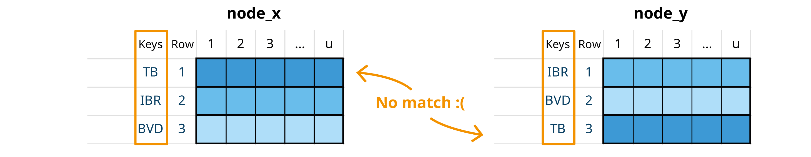

2.  Assign common group ids, based on keys

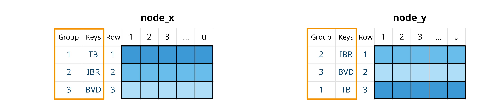

3.  Reorder rows to align group ids. This is similar to dplyr
    `left_join`

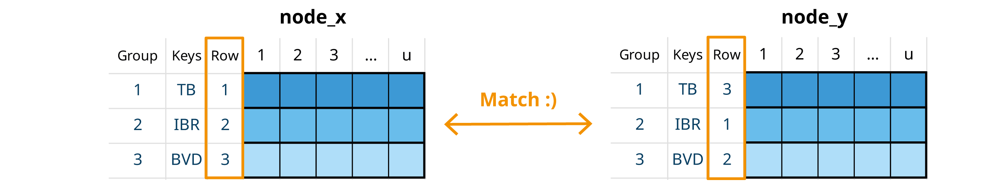

### Scenario matching

Nodes with same groups but different scenarios. The general rule for
these operations is that when no scenario is specified, it is assumed
that a variable takes the values from the baseline scenario.

1.  Check if scenarios are different

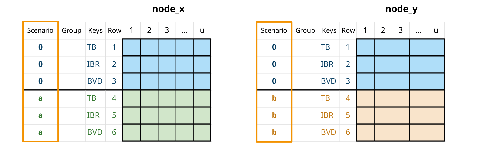

2.  For missing scenarios, duplicate the baseline scenario (scenario
    “0”)

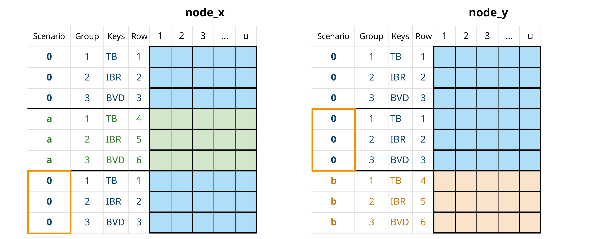

3.  When nodes matched by scenario are used in an element-wise
    operation, the resulting node will contain all scenarios from both
    input nodes. This is conceptually similar to a dplyr `full_join`,
    except that any unmatched rows use values from the baseline
    scenario.

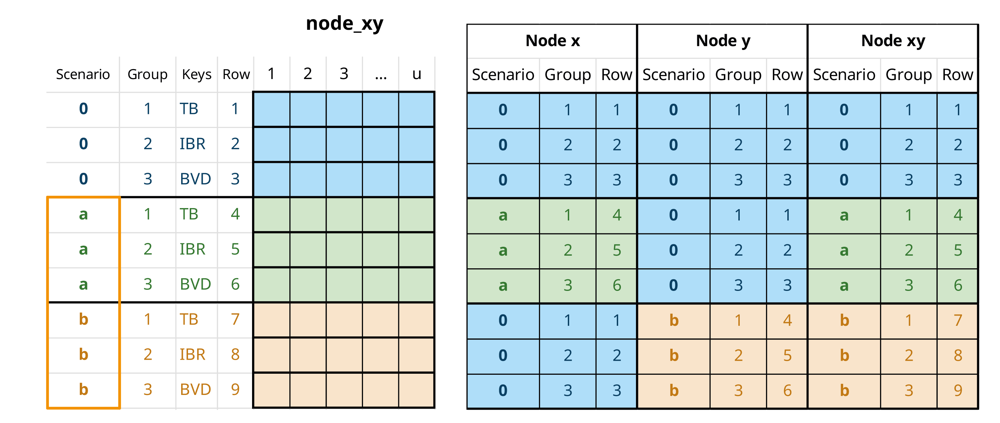

### Null matching

When nodes contain different scenarios and groups, some groups may be
missing from certain nodes. These missing groups (called “null”
variates) are assigned a probability of 0. This operation typically
complements scenario matching.

1.  Check for missing groups

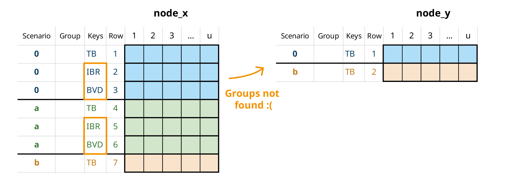

2.  Add null variates with probability 0 for any missing groups (and
    apply scenario matching)

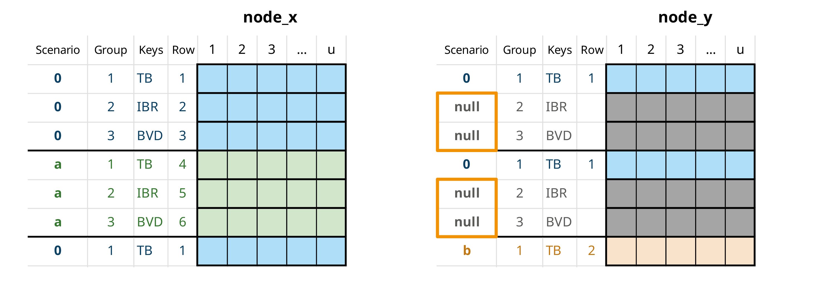

1.  When nodes are matched by scenario in an element-wise operation, the
    resulting node will contain all groups from both input nodes

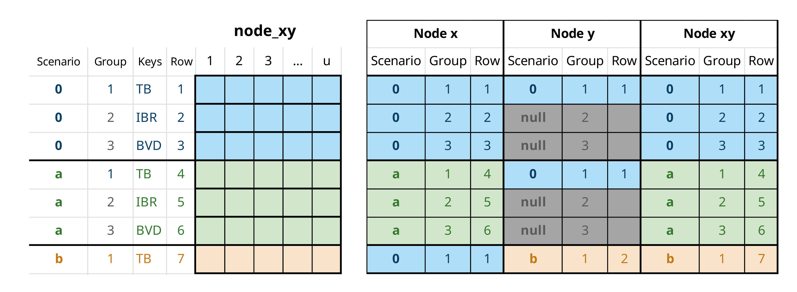

## Combined probabilities

A special type of element-wise operation that automatically deals with
row matching. Combines probabilities of multiple events assuming
independence, using the formula:

$$P(A \cup B) = 1 - \left( 1 - P(A) \right)\left( 1 - P(B) \right)$$

## Row aggregation

Row aggregation operations combine values across multiple rows
(variates) in an mcnode using specific criteria. These operations
calculate overall probabilities or sum quantities across groups.

### Probabilities

Some events can occur independently across multiple variates of the same
node. For example, a disease might be present in animals from different
regions or farms. To calculate the probability of an **event occurring
in at least one variate** within a subset, we first group the data by
aggregation keys (*agg_keys*). Then, for each subset, we use the
standard probability formula for independent trials to find the
probability of the event occurring in at least one variate.

$$p\_{agg} = 1 - \prod\limits_{p \subseteq S}(1 - p)$$

Where:

- *S* represents the subset of variates included in the aggregation

- *p* represents the probability of an event occurring

- *p_agg* represents the probability of occurrence in at least one
  variate of S


Row aggregation by pathogen. The calculation is performed element-wise
across subset variates to maintain uncertainty propagation.

If scenarios are being simulated, scenario id must always be included as
an aggregation key, as probabilities are not calculated across different
what-if scenarios.

You can also keep all variariates, with their corresponding aggregated
values, to ensure dimensions compatibility in further calculations.


Default row aggregation and row aggregation keeping all variates

### Quantities

When working with quantities (such as number of animals or farms), we
calculate totals by summing values across variates within each subset.

$$n\_{agg} = \sum\limits_{n \subseteq S}n$$

Where:

- *S* represents the subset of variates included in the aggregation

- *n* represents the quantity value

- *n_agg* represents the sum of quantities across all variates in *S*

## Trials

In this framework, nodes typically represent the probability of
**success for a** **single trial with a binary outcome**
(success/failure). A trial is one instance where an event might occur,
for example, an animal, farm, batch, animal movement, or farm visit.
Each trial has two possible outcomes, such as whether an animal is
infected or not, or whether a test is positive or negative. In
**single-level** trials, all trials are independent and have the same
probability of success[¹](#fn1).

Some probability processes follow a hierarchical structure where events
occur at different levels. For example, when animals are purchased from
multiple farms, we must consider both the probability of a farm being
infected and the probability of an individual animal within that farm
being infected. This means infection probabilities for animals from the
same farm are not independent. In **multilevel** trials, trials are
organized into subsets, with each subset having its own selection
probability. A subset represents a group sharing specific
characteristics, for example, animals from the same farm or with the
same health status.

Most of the following probability processes and calculations are based
on Chapter 5 of the *Handbook on Import Risk Analysis for Animals and
Animal Products Volume 2. Quantitative risk assessment* ([Murray
2004](#ref-Murray2004)).

### Single-level trials

In single-level trials, each trial is independent with the same
probability of success ($trial\_ p$). For a set of $trials\_ n$ trials,
the probability of at least one success is:

$$set\_ p = 1 - (1 - trial\_ p)^{trials\_ n}$$

In `imports_mcmodule`, we have the probability that an infected animal
from an infected farm goes undetected ($no\_ detect\_ a$). When all
animals (in a variate) have the same probability, we can use the total
number of animals selected per farm ($animals\_ n$) as the number of
trials (`trials_n`) to determine the probability that at least one
infected animal from one farm is not detected ($no\_ detect\_ set$).
Note that while $animals\_ n$ isn’t defined as an mcnode in
`imports_mcmodule` (not used in `imports_mcmodule$model_exp`), it can be
automatically generated in
[`trial_totals()`](https://nataliaciria.github.io/mcmodule/reference/trial_totals.md)
because it’s included in `imports_mctable` and the required data exists
in `imports_mcmodule$data`.

``` r
# Single-level trial
imports_mcmodule <- trial_totals(
  mcmodule = imports_mcmodule,
  mc_names = "no_detect_a", # trial_p
  trials_n = "animals_n",
  mctable = imports_mctable
)

# Probability that at least one infected animal from an infected farm is not detected
mc_summary(imports_mcmodule,"no_detect_a_set")[,-1]
#>   pathogen origin      mean           sd       Min      2.5%       25%
#> 1        a   nord 0.9999344 7.271373e-05 0.9994190 0.9997340 0.9999148
#> 2        a  south 0.9999945 9.174980e-06 0.9998817 0.9999651 0.9999936
#> 3        a   east 1.0000000 3.759259e-10 1.0000000 1.0000000 1.0000000
#> 4        b   nord 0.9994337 7.901747e-04 0.9939744 0.9970818 0.9993747
#> 5        b  south 1.0000000 4.055315e-14 1.0000000 1.0000000 1.0000000
#> 6        b   east 1.0000000 0.000000e+00 1.0000000 1.0000000 1.0000000
#>         50%       75%     97.5%       Max  nsv Na's
#> 1 0.9999601 0.9999825 0.9999952 0.9999982 1001    0
#> 2 0.9999979 0.9999993 0.9999999 1.0000000 1001    0
#> 3 1.0000000 1.0000000 1.0000000 1.0000000 1001    0
#> 4 0.9997226 0.9998992 0.9999833 0.9999951 1001    0
#> 5 1.0000000 1.0000000 1.0000000 1.0000000 1001    0
#> 6 1.0000000 1.0000000 1.0000000 1.0000000 1001    0
```

### Multilevel trials

### Simple multilevel

In multilevel trials, we account for hierarchical structures where
trials are organized into subsets. For example, when considering animals
($trials\_ n$) from different farms ($subset\_ n$), we must account for
both the farm’s selection probability ($subset\_ p$) and the individual
animal’s probability of success ($trial\_ p$).

The probability of at least one success in this hierarchical structure
is given by:

$$set\_ p = 1 - \left( 1 - subset\_ p \cdot \left( 1 - (1 - trial\_ p)^{trial\_ n} \right) \right)^{subset\_ n}$$

Where:

- *trials_p* represents the probability of a trial in a subset being a
  success

- *trials_n* represents the number of trials in subset

- *subset_p* represents the probability of a subset being selected

- *subset_n* represents the number of subsets

- *set_p* represents the probability of a at least one trial of at least
  one subsetbeing a success

When considering animals (`trials_n`) from different farms (`subset_n`,
we must account for both the farm’s probability of being infected
(`subsets_p`) and the individual animal’s probability of being infected
(`trial_p`).

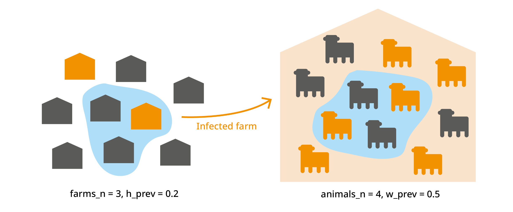


``` r
# Simple multilevel trial
imports_mcmodule <- trial_totals(
  mcmodule = imports_mcmodule,
  mc_names = "no_detect_a", # trial_p
  trials_n = "animals_n",
  subsets_n = "farms_n",
  subsets_p = "h_prev",
  mctable = imports_mctable
)

# Probability that at least one infected animal from at least one farm is not detected
mc_summary(imports_mcmodule,"no_detect_a_set", digits=2)[,-1]
#>   pathogen origin mean     sd  Min 2.5%  25%  50%  75% 97.5%  Max  nsv Na's
#> 1        a   nord 0.38 0.0200 0.34 0.34 0.36 0.38 0.39  0.41 0.41 1001    0
#> 2        a  south 0.30 0.0600 0.18 0.19 0.24 0.30 0.36  0.40 0.40 1001    0
#> 3        a   east 0.60 0.0400 0.52 0.53 0.57 0.60 0.64  0.67 0.68 1001    0
#> 4        b   nord 0.99 0.0081 0.97 0.97 0.98 0.99 0.99  1.00 1.00 1001    0
#> 5        b  south 0.96 0.0081 0.94 0.94 0.95 0.96 0.97  0.97 0.97 1001    0
#> 6        b   east 0.97 0.0200 0.92 0.92 0.95 0.97 0.98  0.99 0.99 1001    0
```

### Multiple group multilevel trials

In multiple group multilevel trials, several variates (groups) can
belong to the same subset. For example, when selecting animals of
different categories (cow, calf, heifer, bull) from the same farm, their
infection probabilities are not independent. You should include
aggregation keys for groups that are not independent to calculate their
trial probabilities, for example, aggregating variates for different
animal categories by farm. For this calculation, the subset_p and
subset_n values must be identical across all variates being aggregated.

$$trial\_ p\_ agg = 1 - \prod\limits_{trial\_ p \subseteq S}(1 - trial\_ p)^{trial\_ n}$$

$$set\_ p\_ agg = 1 - (1 - subset\_ p \cdot trial\_ p\_ agg)^{subset\_ n}$$

Where:

- S represents the variates included in the aggregation

- *trials_p* represents the probability of success of a trial in a
  subset

- *trials_n* represents the number of trials in subset

- *trials_p* *\_agg* represents the probability of success of at least
  one variate in at least one of the aggregated variates

- *subset_p* represents the probability of a subset being selected

- *subset_n* represents the number of subsets

- *set_p_agg* represents the probability of success of a at least one
  trial in at least one of the aggregated variates in at least one
  subset

As with row aggregation, you can keep all variates to maintain
dimensions compatibility in further calculations.

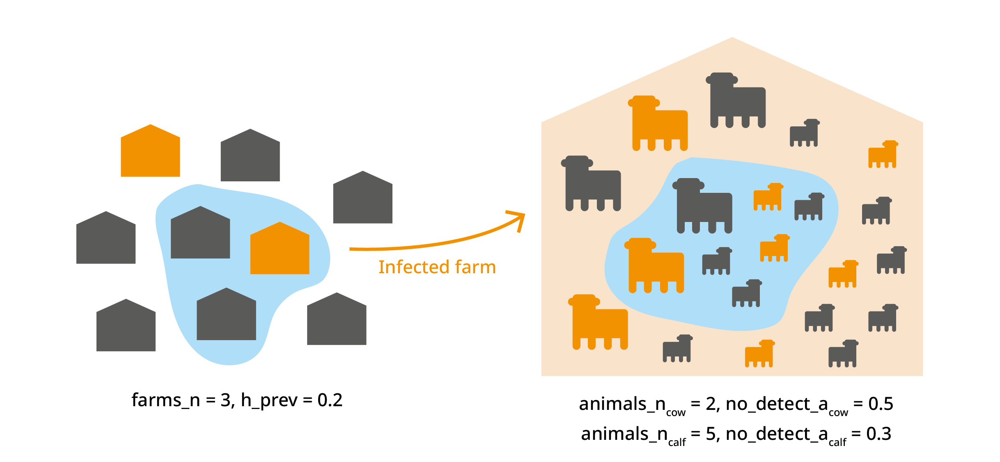

Murray, Noel. 2004. *Handbook on Import Risk Analysis for Animals and
Animal Products Volume 2 Quantitative Risk Assessment*. Vol. 2.
<https://rr-africa.woah.org/app/uploads/2018/03/handbook_on_import_risk_analysis_-_oie_-_vol_ii.pdf>.

------------------------------------------------------------------------

1.  In this context, a “success” refers to the occurrence of an event of
    interest, which may actually represent an undesirable outcome such
    as the presence of a disease or a positive test result for a
    pathogen.
