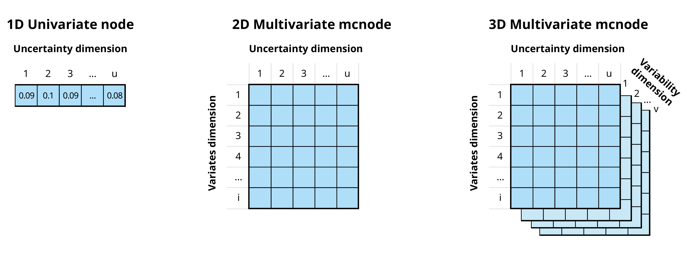

# Getting started

This is a gentle and casual welcome to Monte Carlo risk analysis and the use of [`mcmodule`](https://nataliaciria.github.io/mcmodule/). For a more formal approach you can read the package official [vignette](https://nataliaciria.github.io/mcmodule/articles/mcmodule.html).

I developed this new R package because I could not find any suitable tools for creating complex risk analysis models with thousands of parameters, hundreds of cases, dozens of scenarios, and multiple pathways in R (or in any other software accessible to epidemiologists).

Formally, `mcmodule` is a framework for building modular Monte Carlo risk analysis models. It extends the capabilities of `mc2d` to make working with multiple risk pathways, variates, and scenarios easier. The package includes tools for creating stochastic objects from data frames, visualizing results, and performing uncertainty, sensitivity, and convergence analysis.

For me, `mcmodule` was a little set of custom functions that was born out of necessity and grew out of obsession. Eventually, the effort and lessons learned in building smooth, large-scale risk analysis in R were so great that it was something I couldn't keep just for our [farmR!SK](https://github.com/VetEpi-UAB/farmrisk) project. Now, I hope this package can help other epidemiologists (and risk modellers from other disciplines), not only to save a few hours of work, but also to be ambitious and design complex risk pathways knowing that it will be feasible to evaluate them in R.

## Risk assessment

This section provides a brief introduction to risk assessment in R. Although this package is not intended for beginners in risk assessment, it can help you understand the logic behind mcmodule and its purpose.

### A simple risk assessment

Let's imagine we want to buy a heifer from a friend. We know their farm is infected with pathogen A, a disease that your farm is free from. To reduce risk, we plan to perform a diagnostic test before bringing the heifer to our farm. We want to calculate the probability of introducing the disease if we purchase one heifer that tests negative.

Risk assessment is a technique to estimate the probability and impact of an "adverse" event. It identifies the steps necessary for the event to occur and assigns them a probability. In our case, we have some uncertainty around the probability that an animal in a herd is infected and around the test sensitivity, so we want to conduct a probabilistic or stochastic risk assessment that can account for that uncertainty.

The risk assessment for our cattle purchase can be performed using base R random sampling functions, or `mc2d` [@mc2d], a package provides additional probability distributions (such as rpert) and other useful tools for analyzing stochastic (Monte-Carlo) simulations.

```{r, warning=FALSE, message=FALSE}
library(mc2d)
set.seed(123)
n_iterations <- 10000

# Within-herd prevalence
w_prev <- mcstoc(runif, min = 0.15, max = 0.2, 
                 nsu = n_iterations, type="U")
# Test sensitivity
test_sensi <- mcstoc(rpert, min = 0.89, mode = 0.9, max = 0.91, 
                     nsu = n_iterations, type="U")
# Probability an animal is tested in origin
test_origin <- mcdata(1, type="0") #Yes


# EXPRESSIONS
# Probability that an animal in an infected herd is infected (a = animal)
inf <- w_prev
# Probability an animal is tested and is a false negative 
# (test specificity assumed to be 100%)
false_neg <- inf * test_origin * (1 - test_sensi)
# Probability an animal is not tested
no_test <- inf * (1 - test_origin)
# Probability an animal is not detected
no_detect <- false_neg + no_test

mc_model<-mc(w_prev, inf, test_origin, test_sensi, 
             false_neg, no_test, no_detect)

# RESULT
hist(mc_model)
no_detect
```

### Multiple risk assessments at once

In the previous example, we calculated the risk for one specific case. However, we know that this farm is also positive for pathogen B, so it would be also interesting to calculate the risk of introducing it as well. Pathogen B has different within-herd prevalence and test sensitivity than Pathogen A.

To estimate the risk for both pathogens with our previous models, we could:

-   Copy and paste the code twice with different parameters (against all good coding practices)

-   Wrap the code in a function and call it twice using each pathogen's parameters as arguments

-   Create a loop

While these options work, they become messy or computationally intensive when the number of parameters or different situations to simulate increases.

The package `mc2d` offers a clever solution to this scalability problem: variates. In this package, parameters are stored as **mcnode** class objects. These objects are arrays of numbers that represent random variables and have three dimensions: **variability × uncertainty × variates**.

{fig-align="center"}

In the previous example, our stochastic nodes only had uncertainty dimension. However, we can now use the **variates** dimension to calculate the risk of introduction of both pathogens at the same time.

```{r}
set.seed(123)
n_iterations <- 10000

# Within-herd prevalence
w_prev_min <- mcdata(c(a = 0.15, b = 0.45), nvariates = 2, type="0")
w_prev_max <- mcdata(c(a = 0.2, b = 0.6), nvariates = 2, type="0")

w_prev <- mcstoc(runif, min = w_prev_min, max = w_prev_max, 
                 nsu = n_iterations, nvariates = 2, type="U")

# Test sensitivity
test_sensi_min <- mcdata(c(a = 0.89, b = 0.80), nvariates = 2, type = "0")
test_sensi_mode <- mcdata(c(a = 0.9, b = 0.85), nvariates = 2, type = "0")
test_sensi_max <- mcdata(c(a = 0.91, b = 0.90), nvariates = 2, type = "0")

test_sensi <- mcstoc(rpert, min = test_sensi_min, 
                     mode = test_sensi_mode, max = test_sensi_max, 
                     nsu = n_iterations, nvariates = 2, type="U")

# Probability an animal is tested in origin
test_origin <- mcdata(c(a = 1, b = 1), nvariates = 2, type="0")


# EXPRESSIONS
# Probability that an animal in an infected herd is infected (a = animal)
inf <- w_prev
# Probability an animal is tested and is a false negative 
# (test specificity assumed to be 100%)
false_neg <- inf * test_origin * (1 - test_sensi)
# Probability an animal is not tested
no_test <- inf * (1 - test_origin)
# Probability an animal is not detected
no_detect <- false_neg + no_test

mc_model<-mc(w_prev, inf, test_origin, test_sensi, 
             false_neg, no_test, no_detect)

# RESULT
no_detect
```

Instead of manually typing the parameter values, you can also use columns from a data table in `mcdata()`. A useful template for setting up risk analysis models using `mc2d`, with custom functions to facilitate data manipulation and visualization, can be found in this repository: <https://github.com/NataliaCiria/risk_analysis_template>.

## When to use mcmodule?

The `mc2d` multivariate approach works well for basic multivariate risk analysis. However, if instead of purchasing one cow, you're dealing with multiple cattle purchases, from different farms, across different pathogens, scenarios, and age categories, or modeling multiple risk pathways with different what-if scenarios, this approach becomes unwieldy.

`mcmodule` addresses these challenges by providing functions for **multivariate operations** and **modular management** of the risk model. It automates the process of creating mcnodes and assigns metadata to them (making it easy to identify which variate corresponds to which data row). Thanks to this mcnode metadata, it enables row-matching between nodes with different variates, combines probabilities across variates, and calculates multilevel trials. As your risk analysis grows, you can create separate modules for different pathways, each with independent parameters, expressions, and scenarios that can later be connected into a complete model.

This package is particularly useful for:

-   **Working with complex models** that involve multiple pathways, pathogens, or scenarios simultaneously

-   **Dealing with large parameter sets** (hundreds or thousands of parameters)

-   **Handling different numbers of variates** across different parts of your model that need to be combined

-   **Creating modular risk assessments** where different components need to be developed independently but later integrated (for example in collaborative projects)

-   **Performing sophisticated sensitivity analyses** across multiple model components

However, for simpler analyses, such as single pathway models, exploratory work, small models with few parameters, one-off analyses or learning risk assessment `mcmodule`'s additional structure may be unnecessary.

## Installing mcmodule

Now let's explore this new package! It's about to be submitted to CRAN, but since it's not there yet, we'll install it from GitHub instead.

```{r, eval=FALSE}
# install.packages("devtools")
devtools::install_github("NataliaCiria/mcmodule")
```

And we load the package in our R session. Easy-peasy, ready to go!

```{r}
library(mcmodule)
```

Other recommended packages to load along with mcmodule are:

```{r, warning=FALSE, message=FALSE}
library(dplyr)     # Data manipulation
library(ggplot2)   # Plots
library(igraph)    # Network analysis
library(visNetwork)# Interactive network visualization
```

# Building an mcmodule

To quickly understand the key components of an mcmodule, we'll start by building one using the animal imports example included in the package. For a more detailed view of each component, refer to the [model elements](https://nataliaciria.github.io/mcmodule/articles/mcmodule.html#model-elements) section in the package vignette.

## Data

Let's consider a scenario where we want to evaluate the risk of introducing pathogen A and pathogen B into our region from animal imports from different regions (north, south, east, and west). We have gathered the following data:

-   `animal_imports`: number of animal imports with their mean and standard deviation values per region, and the number of exporting farms in each region.

    ```{r}
    animal_imports
    ```

-   `prevalence_region`: estimates for both herd and within-herd prevalence ranges for pathogens A and B, as well as an indicator of how often tests are performed in origin

    ```{r}
    prevalence_region
    ```

-   `test_sensitivity`: estimates of test sensitivity values for pathogen A and B

    ```{r}
    test_sensitivity
    ```

Now we will use `dplyr::left_join()` to create our imports module data:

```{r}
imports_data<-prevalence_region%>%
   left_join(animal_imports)%>%
   left_join(test_sensitivity)%>%
   relocate(pathogen, origin, test_origin)
```

## Data keys

From now on we will use only the merged `imports_data` table. However, it is useful to understand which input dataset each parameter comes from, as each dataset provides information for different keys. In this context, keys are fields that (combined) uniquely identify each row in a table. In our example:

-   `animal_imports` provided information by region of `"origin"`

-   `prevalence_region` provided information by `"pathogen"` and region of `"origin"`

-   `test_sensitivity` provided information by `"pathogen"` only

The resulting merged table, `imports_data`, will therefore have two keys: `"pathogen"` and `"origin"`. However, not all parameters will use both keys, for example, `"test_sensi"` only has information by `"pathogen"`. Knowing the keys for each parameter is crucial when performing multivariate operations, such as [calculating totals](https://nataliaciria.github.io/mcmodule/articles/intro.html#calculating-totals).

To make these relationships explicit in the model, we need to provide the data keys. These are defined in a list with one element for each input dataset, specifying both the columns and the keys for each dataset.

```{r}
imports_data_keys <- list(
  animal_imports =  list(
    cols = names(animal_imports),
    keys = "origin"
  ),
  prevalence_region = list(
    cols = names(prevalence_region),
    keys = c("pathogen", "origin")
  ),
  test_sensitivity = list(
    cols = names(test_sensitivity),
    keys = "pathogen"
  )
)
```

## mcnodes table

With values and keys established, we still need some information to build our stochastic parameters. The mcnode table specifies how to build mcnodes from the data table. It specifies which parameters are included in the model, the type of parameters (those with an mc_func are stochastic), and what columns to look for in the data table to build this mcnodes (the name of the mcnode, or another variable in the data columns), as well as transformations that are usefull to encode categorical data values into mcnodes that must always be numeric.

-   mcnode: Name of the Monte Carlo node (required)

-   description: Description of the parameter

-   mc_func: Probability distribution

-   from_variable: Column name, if it comes from a column with a name different to the mcnode

-   transformation: Transformation to be applied to the original column values

-   sensi_analysis: Whether to include in sensitivity analysis

Here we have the `imports_mctable` for our example. While the mctable can be hard-coded in R, it's more efficient to prepare it in a CSV or other external file. This approach also allows the table to be included as part of the model documentation.

```{r, echo = FALSE}
# Display the table with horizontal scrolling
imports_mctable %>%
  mutate(transformation=ifelse(mcnode=="test_origin", 'ifelse(value == "always", 1, ifelse(value == "sometimes", 0.5, ifelse(value == "never", 0, NA)))',transformation)) %>%
  knitr::kable() #%>%
  #kableExtra::kable_classic(full_width = TRUE) #%>%
  #kableExtra::scroll_box(width = "100%")
```

The data table and the mctable must complement each other:

-   mcnodes without a `mc_func` (like `farms_n`), needs the matching column name (`"farms_n"`) in the data table

-   mcnodes with an `mc_func`, you need **columns for each probability distribution argument in the** **data table**. For example:

    -   `h_prev` with `runif` distribution requires `"h_prev_min"` and `"h_prev_max"`

    -   `animals_n` with `rnorm` distribution requires `"animals_n_mean"` and `"animals_n_sd"`

For encoding categorical variables as mcnodes (or any other data transformation), you can use any R code with `value` as a placeholder for the mcnode name or column name (specified in `from_variable`)

## Expressions

Finally, we need to write the model's mathematical expression. This expressions should ideally include only arithmetic operations, not R functions (with some exceptions that will be covered later in "[tricks and tweaks](https://nataliaciria.github.io/mcmodule/articles/intro.html#tricks-and-tweaks)"). We'll wrap them using `quote()` so they aren't executed immediately but stored for later evaluation with `eval_model()`.

```{r}
imports_exp<-quote({
  # Probability that an animal in an infected herd is infected (a = animal)
  inf <- w_prev
  # Probability an animal is tested and is a false negative 
  # (test specificity assumed to be 100%)
  false_neg <- inf * test_origin * (1 - test_sensi)
  # Probability an animal is not tested
  no_test <- inf * (1 - test_origin)
  # Probability an animal is not detected
  no_detect <- false_neg + no_test
})
```

## Evaluating an mcmodule

With all components in place, we're now ready to create our first mcmodule using `eval_module()`.

```{r}
imports<-eval_module(
  exp = c(imports=imports_exp),
  data = imports_data,
  mctable = imports_mctable,
  data_keys = imports_data_keys
)
```

```{r}
class(imports)
```

An mcmodule is an S3 object class, and it is essentially a list that contains all risk assessment components in a structured format.

```{r}
names(imports)
```

The mcmodule contains the input `data` and mathematical expressions (`exp`) that ensure traceability. All input and calculated parameters are stored in `node_list`. Each node contains not only the mcnode itself but also important metadata: node type (input or output), source dataset and columns, keys, calculation method, and more. The specific metadata varies depending on the node's characteristics. Here are a few examples:

```{r}
imports$node_list$w_prev
imports$node_list$no_detect
```

And now that we have an mcmodule, we can begin exploring its possibilities!

# Working with an mcmodule

## Visualizing

```{r}
mc_network(imports)
```

## Summarizing {#sec-calculating-totals}

In the imports mcmodule, we can already see the raw mcnode results for the probability of an imported animal not being detected (`no_detect`). However, it's difficult to determine which pathogen or region these results refer to. The `mc_summary()` function solves this problem by linking mcnode results with their key columns in the data.

> Note that while the printed summary looks similar to the raw mcnode, it's actually just a dataframe containing statistical measures, whereas the actual mcnode is a large array of numbers with dimensions (uncertainty × 1 × variates),

```{r}
mc_summary(mcmodule = imports, mc_name = "no_detect")
```

## Calculating totals

### Single-level trials

In `imports`, we have the probability that an infected animal from an infected farm goes undetected (`"no_detect"`). When all animals (in a variate) have the same probability, we can use the total number of animals selected per farm (`"animals_n"`) as the number of trials (`trials_n`) to determine the probability that at least one infected animal from one farm is not detected (no_detect_set).

> Note that while `"animals_n"` is not found as an mcnode in `imports` (it was not used in `imports$exp`), it can be automatically generated in `trial_totals()` because it’s included in `imports_mctable` and the required data exists in `imports$data`.

```{r}
# Probability of at least one imported animal from an infected herd is not detected 
imports <- trial_totals(
  mcmodule = imports,
  mc_names = "no_detect",
  trials_n = "animals_n",
  mctable = imports_mctable
)
```

Note that this function returns an mcmodule with some additional nodes. Total nodes have special metadata fields, and always include a summary by default.

```{r}
imports$node_list$no_detect_set$summary
```

### Multilevel trials

#### Simple multilevel

When considering animals (trials_n) from different farms (subset_n), we must account for both the farm’s probability of being infected (subset_p) and the individual animal’s probability of being infected (trial_p).


```{r}
# Probability of at least one animal from at least one herd being is not detected (probability of a herd being infected: h_prev)
imports <- trial_totals(
  mcmodule = imports,
  mc_names = "no_detect",
  trials_n = "animals_n",
  subsets_n = "farms_n",
  subsets_p = "h_prev",
  mctable = imports_mctable
)

# Result
imports$node_list$no_detect_set
```

# Combining mcmodules

```{r}

```

# Analysing mcmodule models

## **Convergence** analysis

Checks if all variates in all parameters converge in the unceratainty dimensions for the number of simulations performed.

## Sensitivity analysis

Parameters included specified in the mctable.

### Relative Change

### **Spearman Correlation**

# Tricks and tweaks {#sec-tricks-and-tweaks}

## Remove mcnode NAs

```{r}
sample_mcnode <- mcstoc(runif,
               min = mcdata(c(NA, 0.2, -Inf), type = "0", nvariates = 3),
               max = mcdata(c(NA, 0.3, Inf), type = "0", nvariates = 3),
               nvariates = 3
)

# Replace NA and Inf with 0
clean_mcnode <- mcnode_na_rm(sample_mcnode)
```

Useful to include in expressions were there is a division with a denominator can potentially be 0 and it will return `Inf` or `NaN`, but we actually want that parameter to be 0.

## Include functions in expressions

## Some functions that can be used without mcmodules

mc_summary with data and mcmodule

create_mcnodes

# Recommended workflow

# References
