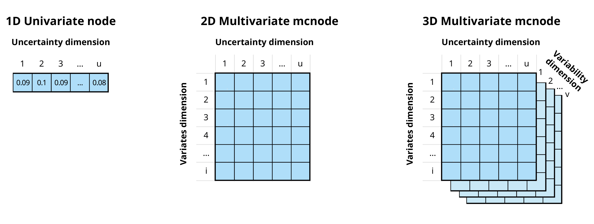
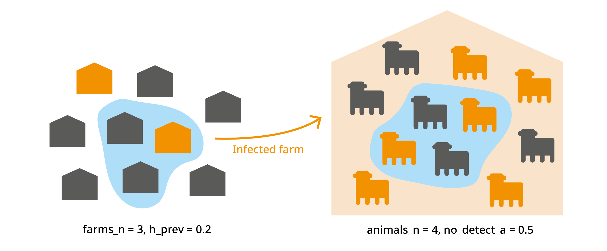
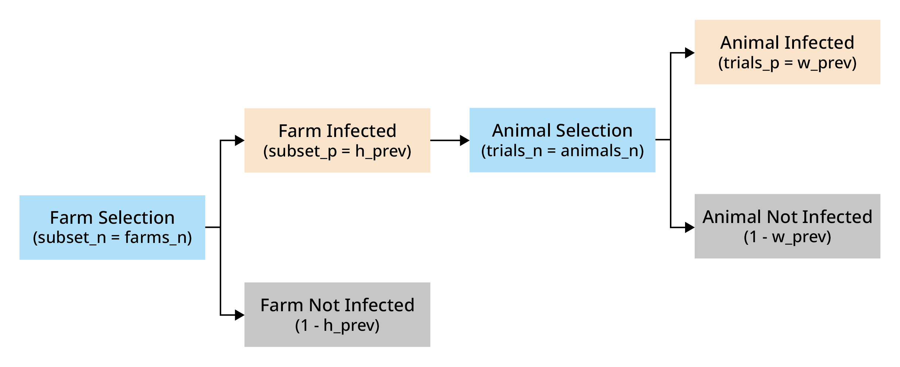
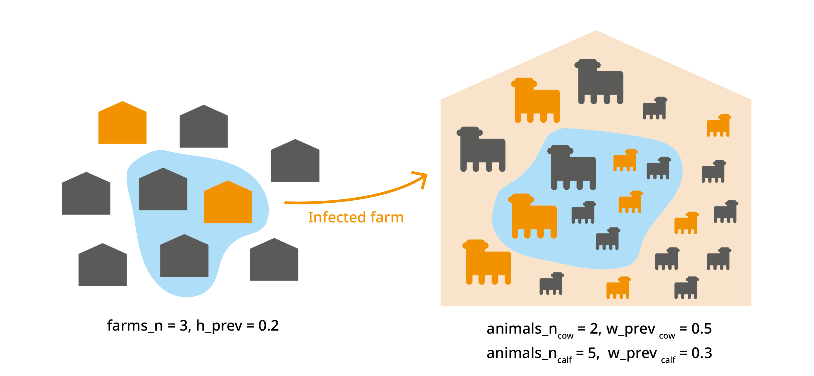

```{r, include = FALSE}
knitr::opts_chunk$set(
  collapse = TRUE,
  comment = "#>"
)
library(mcmodule)
```

> *Work in progress!* 🏗

# Introduction

`mcmodule` is a framework for building modular Monte Carlo risk analysis models. It extends the capabilities of `mc2d` to make working with multiple risk pathways, variates, and scenarios easier. It was developed by epidemiologists, for the [farmrisk](https://github.com/VetEpi-UAB/farmrisk) project, and now it aims to help epidemiologists and other risk modellers save time and evaluate ambitious, complex risk pathways in R.

The `mc2d` R package [@mc2d] provides tools to build and analyse models involving multiple variables and uncertainties based on Monte Carlo simulations. The `mcmodule` package includes additional tools to:

1.  Organize risk analysis in independent flexible modules
2.  Perform multivariate mcnode operations
3.  Automate the creation of mcnodes
4.  Visualize risk analysis models

## Multivariate Monte-Carlo simulations

Quantitative risk analysis is the numerical assessment of risk to facilitate decision making in the face of uncertainty. Monte Carlo simulation is a technique used to model and analyse uncertainty [@Vose2008].

In `mc2d`, parameters are stored as **mcnode** class objects. These objects are arrays of numbers that represent random variables and have three dimensions: **variability × uncertainty × variates**. For more information, see the [mc2d](https://CRAN.R-project.org/package=mc2d) package vignette.

{fig-align="center"}

In the `mcmodule` framework an mcnode is an array of **dimensions (*u* × 1 × *i*)**:

-   We combine **variability** and **uncertainty** into one dimension[^1] (***u***)

-   We use **variates** (representing different groups or categories) in the other dimension (***i***)

-   The variables that define and distinguish these variates are called **keys** and are stored as metadata

[^1]: It would be technically possible to separate variability and uncertainty in `mcmodule`, but we have not included this functionality yet because of the exponential increase in computational and programming requirements

In this document we will use the term "uncertainty dimension" to refer to the combined dimension of variability and uncertainty.

> **Example**
>
> If we are buying a number of cows and heifers from a specific region, an mcnode for herd prevalence would have:
>
> -   Multiple variates (rows), defined by two keys: "animal category" and "pathogen"
>
> -   Probability values generated through a PERT distribution, using minimum, mode, and maximum parameters across *u* iterations (columns) to model the uncertainty in these estimates
>
> {fig-align="center" style="display: block; margin: 1em auto" width="85%"}

## Risk assessment

This section provides a brief introduction to risk assessment in R. Although this package is not intended for beginners in risk assessment, it can help you understand the logic behind `mcmodule` and its purpose.

### A simple risk assessment

Consider a scenario where we need to purchase a cow from a farm that we know is infected with a disease our farm is free from. To reduce the risk of introducing the disease to our farm, we plan to perform a diagnostic test on the cow before bringing it to our farm. We want to calculate the probability of introducing the disease by purchasing one cow that tests negative.

We have an estimation (with some uncertainty) of both the probability of animal infection within a herd and the test sensitivity, so we want to conduct a **stochastic** risk assessment that properly accounts for this **uncertainty**.

The risk assessment for our cattle purchase can be performed using base R [@base] random sampling functions, or `mc2d` [@mc2d], a package provides additional probability distributions (such as `rpert`) and other useful tools for analysing stochastic (Monte-Carlo) simulations.

```{r, warning=FALSE, message=FALSE}
library(mc2d)
set.seed(123)
n_iterations <- 10000

# Within-herd prevalence
w_prev <- mcstoc(runif,
  min = 0.15, max = 0.2,
  nsu = n_iterations, type = "U"
)
# Test sensitivity
test_sensi <- mcstoc(rpert,
  min = 0.89, mode = 0.9, max = 0.91,
  nsu = n_iterations, type = "U"
)
# Probability an animal is tested in origin
test_origin <- mcdata(1, type = "0") # Yes


# EXPRESSIONS
# Probability that an animal in an infected herd is infected (a = animal)
infected <- w_prev
# Probability an animal is tested and is a false negative
# (test specificity assumed to be 100%)
false_neg <- infected * test_origin * (1 - test_sensi)
# Probability an animal is not tested
no_test <- infected * (1 - test_origin)
# Probability an animal is not detected
no_detect <- false_neg + no_test

mc_model <- mc(
  w_prev, infected, test_origin, test_sensi,
  false_neg, no_test, no_detect
)

# RESULT
hist(mc_model)
no_detect
```

### Multiple risk assessments at once

In the previous example, we calculated the risk for one specific case. However, we know that this farm is also positive for pathogen B, so it would be also interesting to calculate the risk of introducing it as well. Pathogen B has different within-herd prevalence and test sensitivity than Pathogen A.

To estimate the risk for both pathogens with our previous models, we could:

-   Copy and paste the code twice with different parameters (against all good coding practices)

-   Wrap the code in a function and call it twice using each pathogen's parameters as arguments

-   Create a loop

While these options work, they become messy or computationally intensive when the number of parameters or different situations to simulate increases.

The package `mc2d` offers a clever solution to this scalability problem: variates. In the previous example, our stochastic nodes only had uncertainty dimension. However, we can now use the **variates** dimension to calculate the risk of introduction of both pathogens at the same time.

```{r}
set.seed(123)
n_iterations <- 10000

# Within-herd prevalence
w_prev_min <- mcdata(c(a = 0.15, b = 0.45), nvariates = 2, type = "0")
w_prev_max <- mcdata(c(a = 0.2, b = 0.6), nvariates = 2, type = "0")

w_prev <- mcstoc(runif,
  min = w_prev_min, max = w_prev_max,
  nsu = n_iterations, nvariates = 2, type = "U"
)

# Test sensitivity
test_sensi_min <- mcdata(c(a = 0.89, b = 0.80), nvariates = 2, type = "0")
test_sensi_mode <- mcdata(c(a = 0.9, b = 0.85), nvariates = 2, type = "0")
test_sensi_max <- mcdata(c(a = 0.91, b = 0.90), nvariates = 2, type = "0")

test_sensi <- mcstoc(rpert,
  min = test_sensi_min,
  mode = test_sensi_mode, max = test_sensi_max,
  nsu = n_iterations, nvariates = 2, type = "U"
)

# Probability an animal is tested in origin
test_origin <- mcdata(c(a = 1, b = 1), nvariates = 2, type = "0")


# EXPRESSIONS
# Probability that an animal in an infected herd is infected (a = animal)
infected <- w_prev
# Probability an animal is tested and is a false negative
# (test specificity assumed to be 100%)
false_neg <- infected * test_origin * (1 - test_sensi)
# Probability an animal is not tested
no_test <- infected * (1 - test_origin)
# Probability an animal is not detected
no_detect <- false_neg + no_test

mc_model <- mc(
  w_prev, infected, test_origin, test_sensi,
  false_neg, no_test, no_detect
)

# RESULT
no_detect
```

## When to use mcmodule?

The `mc2d` multivariate approach works well for basic multivariate risk analysis. However, if instead of purchasing one cow, you're dealing with multiple cattle purchases, from different farms, across different pathogens, scenarios, and age categories, or modelling multiple risk pathways with different what-if scenarios, this approach becomes unwieldy.

`mcmodule` addresses these challenges by providing functions for **multivariate operations** and **modular management** of the risk model. It automates the process of creating mcnodes and assigns metadata to them (making it easy to identify which variate corresponds to which data row). Thanks to this mcnode metadata, it enables row-matching between nodes with different variates, combines probabilities across variates, and calculates multilevel trials. As your risk analysis grows, you can create separate modules for different pathways, each with independent parameters, expressions, and scenarios that can later be connected into a complete model.

This package is particularly useful for:

-   **Working with complex models** that involve multiple pathways, pathogens, or scenarios simultaneously

-   **Dealing with large parameter sets** (hundreds or thousands of parameters)

-   **Handling different numbers of variates** across different parts of your model that need to be combined

-   **Creating modular risk assessments** where different components need to be developed independently but later integrated (for example in collaborative projects)

-   **Performing sophisticated sensitivity analyses** across multiple model components

However, for simpler analyses, such as single pathway models, exploratory work, small models with few parameters, one-off analyses or learning risk assessment `mcmodule`'s additional structure may be unnecessary.

## Installing mcmodule

Now, let's explore the package! We can install it from CRAN:

```{r, eval=FALSE}
install.packages("mcmodule")
library("mcmodule")
```

Or install latest development version from GitHub (requires `devtool` package):

```{r, eval=FALSE}
# install.packages("devtools")
devtools::install_github("NataliaCiria/mcmodule")
library("mcmodule")
```

Other recommended packages to load along with mcmodule are:

```{r, warning=FALSE, message=FALSE}
# install.packages(c("dplyr","ggplot2","igraph","visNetwork"))
library(dplyr) # Data manipulation
library(igraph) # Network analysis
library(visNetwork) # Interactive network visualization
```

# Building an mcmodule

To quickly understand the key components of an mcmodule, we'll start by building one using the animal imports example included in the package.

## Data

Let's consider a scenario where we want to evaluate the risk of introducing pathogen A and pathogen B into our region from animal imports from different regions (north, south, east, and west). We have gathered the following data:

-   `animal_imports`: number of animal imports with their mean and standard deviation values per region, and the number of exporting farms in each region.

    ```{r}
    animal_imports
    ```

-   `prevalence_region`: estimates for both herd and within-herd prevalence ranges for pathogens A and B, as well as an indicator of how often tests are performed in origin

    ```{r}
    prevalence_region
    ```

-   `test_sensitivity`: estimates of test sensitivity values for pathogen A and B

    ```{r}
    test_sensitivity
    ```

Now we will use `dplyr::left_join()` to create our imports module data:

```{r}
imports_data <- prevalence_region %>%
  left_join(animal_imports) %>%
  left_join(test_sensitivity) %>%
  relocate(pathogen, origin, test_origin)
```

## Data keys

From now on we will use only the merged `imports_data` table. However, it is useful to understand which input dataset each parameter comes from, as each dataset provides information for different keys. In this context, keys are fields that (combined) uniquely identify each row in a table. In our example:

-   `animal_imports` provided information by region of `"origin"`

-   `prevalence_region` provided information by `"pathogen"` and region of `"origin"`

-   `test_sensitivity` provided information by `"pathogen"` only

The resulting merged table, `imports_data`, will therefore have two keys: `"pathogen"` and `"origin"`. However, not all parameters will use both keys, for example, `"test_sensi"` only has information by `"pathogen"`. Knowing the keys for each parameter is crucial when performing multivariate operations, such as [calculating totals](https://nataliaciria.github.io/mcmodule/articles/intro.html#calculating-totals).

To make these relationships explicit in the model, we need to provide the data keys. These are defined in a list with one element for each input dataset, specifying both the columns and the keys for each dataset.

```{r}
imports_data_keys <- list(
  animal_imports = list(
    cols = names(animal_imports),
    keys = "origin"
  ),
  prevalence_region = list(
    cols = names(prevalence_region),
    keys = c("pathogen", "origin")
  ),
  test_sensitivity = list(
    cols = names(test_sensitivity),
    keys = "pathogen"
  )
)
```

## mcnodes table

With values and keys established, we still need some information to build our stochastic parameters. The mcnode table specifies how to build mcnodes from the data table. It specifies which parameters are included in the model, the type of parameters (those with an mc_func are stochastic), and what columns to look for in the data table to build these mcnodes (the name of the mcnode, or another variable in the data columns), as well as transformations that are useful to encode categorical data values into mcnodes that must always be numeric.

-   mcnode: Name of the Monte Carlo node (required)

-   description: Description of the parameter

-   mc_func: Probability distribution

-   from_variable: Column name, if it comes from a column with a name different to the mcnode

-   transformation: Transformation to be applied to the original column values

-   sensi_analysis: Whether to include in sensitivity analysis[^2]

[^2]: This column is planned for future versions, as functions for uncertainty, sensitivity, and convergence analysis are currently under development and will be included in the next package

Here we have the `imports_mctable` for our example. While the mctable can be hard-coded in R, it's more efficient to prepare it in a CSV or other external file. This approach also allows the table to be included as part of the model documentation.

```{r, echo = FALSE}
# Display the table with horizontal scrolling
imports_mctable %>%
  mutate(transformation = ifelse(mcnode == "test_origin", 'ifelse(value == "always", 1, ifelse(value == "sometimes", 0.5, ifelse(value == "never", 0, NA)))', transformation)) %>%
  knitr::kable()
```

The data table and the mctable must complement each other:

-   mcnodes without an `mc_func` (like `farms_n`), needs the matching column name (`"farms_n"`) in the data table

-   mcnodes with an `mc_func`, you need **columns for each probability distribution argument in the** **data table**. For example:

    -   `h_prev` with `runif` distribution requires `"h_prev_min"` and `"h_prev_max"`

    -   `animals_n` with `rnorm` distribution requires `"animals_n_mean"` and `"animals_n_sd"`

For encoding categorical variables as mcnodes (or any other data transformation), you can use any R code with `value` as a placeholder for the mcnode name or column name (specified in `from_variable`)

## Expressions

Finally, we need to write the model's mathematical expression. These expressions should ideally include only arithmetic operations, not R functions (with some exceptions that will be covered later in "[tricks and tweaks](https://nataliaciria.github.io/mcmodule/articles/intro.html#tricks-and-tweaks)"). We'll wrap them using `quote()` so they aren't executed immediately but stored for later evaluation with `eval_model()`.

```{r}
imports_exp <- quote({
  # Probability that an animal in an infected herd is infected (a = animal)
  infected <- w_prev
  # Probability an animal is tested and is a false negative
  # (test specificity assumed to be 100%)
  false_neg <- infected * test_origin * (1 - test_sensi)
  # Probability an animal is not tested
  no_test <- infected * (1 - test_origin)
  # Probability an animal is not detected
  no_detect <- false_neg + no_test
})
```

## Evaluating an mcmodule

With all components in place, we're now ready to create our first mcmodule using `eval_module()`.

```{r}
imports <- eval_module(
  exp = c(imports = imports_exp),
  data = imports_data,
  mctable = imports_mctable,
  data_keys = imports_data_keys
)
```

```{r}
class(imports)
```

An mcmodule is an S3 object class, and it is essentially a list that contains all risk assessment components in a structured format.

```{r}
names(imports)
```

The mcmodule contains the input `data` and mathematical expressions (`exp`) that ensure traceability. All input and calculated parameters are stored in `node_list`. Each node contains not only the mcnode itself but also important metadata: node type (input or output), source dataset and columns, keys, calculation method, and more. The specific metadata varies depending on the node's characteristics. Here are a few examples:

```{r}
imports$node_list$w_prev
imports$node_list$no_detect
```

And now that we have an mcmodule, we can begin exploring its possibilities!

## Understanding mcnodes operations

When arithmetic operations are performed between nodes in mcmodule, they are applied on matching elements and keep the original dimensions, allowing uncertainties and variates to propagate through the calculations.

{fig-align="center" style="display: block; margin: 1em auto" width="100%"}

# Working with an mcmodule

## Visualizing

We can visualize an mc_module with the `mc_network()` function. For this, you will need to have `igraph` [@igraph] and `visNetwork` [@visnetwork] installed.

In these network visualizations, input datasets appear in blue, input data files, input columns and input mcnodes appear in different shades of dark-grey-blue, output mcnodes in green, and total mcnodes (as we will see later) in orange. The numbers displayed when clicked correspond to the median and the 95% confidence interval of the first variate of each mcnode.

```{r}
mc_network(imports, legend = TRUE)
```

## Summarizing {#sec-calculating-totals}

In the imports mcmodule, we can already see the raw mcnode results for the probability of an imported animal not being detected (`no_detect`). However, it's difficult to determine which pathogen or region these results refer to. The `mc_summary()` function solves this problem by linking mcnode results with their key columns in the data.

> Note that while the printed summary looks similar to the raw mcnode, it's actually just a dataframe containing statistical measures, whereas the actual mcnode is a large array of numbers with dimensions (uncertainty × 1 × variates),

```{r}
mc_summary(mcmodule = imports, mc_name = "no_detect")
```

## Calculating totals

Most of the following probability calculations are based on Chapter 5 of the *Handbook on Import Risk Analysis for Animals and Animal Products Volume 2. Quantitative risk assessment* [@Murray2004]. More details can be found on the [*Multivariate operations*](https://nataliaciria.github.io/mcmodule/articles/multivariate_operations.html) vignette.

### Single-level trials

In `imports`, we know the probability that an infected animal from an infected farm goes undetected (`"no_detect"`). We can use the total number of animals selected per farm (`"animals_n"`) as the number of trials (`trials_n`) to determine the probability that at least one infected animal from an infected farm is not detected (`no_detect_set`).

In single-level trials, each trial is independent with the same probability of success ($trial\_p$). For a set of $trials\_n$ trials, the **probability of at least one success** is:

$$ set\_p= 1-(1-trial\_p)^{trials\_n} $$

```{r}
# Probability of at least one imported animal from an infected herd is not detected
imports <- trial_totals(
  mcmodule = imports,
  mc_names = "no_detect",
  trials_n = "animals_n",
  mctable = imports_mctable
)
```

The `trial_totals()` function returns the mcmodule with some additional nodes: the probability of at least one success and the expected number of successes. These **total nodes** have special metadata fields, and always include a summary by default.

```{r}
# Probability of at least one
imports$node_list$no_detect_set$summary

# Expected number of animals
imports$node_list$no_detect_set_n$summary
```

### Multilevel trials

#### Simple multilevel

We can also calculate the probability that at least one infected animal from at least one infected farm is not detected, but here, we need to consider two levels: animals and farms.



We import animals from `"farms_n"` farms. Each farm has a probability `"h_prev"` (regional herd prevalence) of being infected. From each farm, we import `"animals_n"` animals. In an infected farm, each animal has a probability `"w_prev"` (within-herd prevalence) of being infected. We've already used this to calculate `"no_detect"`, which is the probability that an infected animal is not detected.



The probability of at least one success in this hierarchical structure is given by:

$$ set\_p= 1-(1-subset\_p \cdot (1-(1-trial\_p)^{trial\_n}))^{subset\_n}  $$

Where:

-   *trials_p* represents the probability of a trial in a subset being a success

-   *trials_n* represents the number of trials in subset

-   *subset_p* represents the probability of a subset being selected

-   *subset_n* represents the number of subsets

-   *set_p* represents the probability of a at least one trial of at least one subset being a success

```{r}
# Probability of at least one animal from at least one herd being is not detected (probability of a herd being infected: h_prev)
imports <- trial_totals(
  mcmodule = imports,
  mc_names = "no_detect",
  trials_n = "animals_n",
  subsets_n = "farms_n",
  subsets_p = "h_prev",
  mctable = imports_mctable,
)

# Result
imports$node_list$no_detect_set$summary
```

It also provides the probability of at least one and the expected number of infected animals by subset (in this case a farm)

```{r}
# Probability of at least one in a farm
imports$node_list$no_detect_subset$summary
```

**Multiple group multilevel trials**

This `trial_totals()` application is beyond the scope of this vignette, but there are cases where you might have several variates from the same subset. For example we could deal with different animal categories (cow, calf, bull...) from the same farm. In this case, the infection probability of animals within the same farm is not independent, and this should be taken into account. For more information, see [Multilevel trials](https://nataliaciria.github.io/mcmodule/articles/multivariate_operations.html#multilevel-trials) in the *Multivariate operations* vignette.



### Aggregated totals

Until this point, all mcnode operations were element-wise, keeping the original dimensions, and allowing uncertainties and variates to propagate through the calculations. However, sometimes, we need to aggregate variates to calculate totals, for example, to total risk of introducing a pathogen across all regions. In this case, we want to preserve the uncertainty dimension but reduce the variates dimension. With `agg_totals()` we can calculate overall probabilities or sum quantities across groups.

```{r}
imports <- agg_totals(
  mcmodule = imports,
  mc_name = "no_detect_set",
  agg_keys = "pathogen"
)

# Result
imports$node_list$no_detect_set_agg$summary
```

Now we can visualize our mcmodule again and see all these new nodes created by the totals functions.

```{r}
mc_network(imports, legend = TRUE)
```

# Working with what-if scenarios

So far, we've only tested our model using current data. But risk analysis is most useful when comparing different scenarios. In our example, we could compare the baseline risk with the risk if tests were always performed in all regions.

To do this this, we only need to add a column called "scenario_id". This name is important as it is used to will recognize it specifically for scenario comparisons, not as regular variate categories. The baseline scenario should be called "0". While not every scenario needs to contain all the variate categories included in the baseline, any variate categories present in alternative scenarios must exist in the baseline.

```{r}
imports_data <- imports_data %>%
  mutate(scenario_id = "0")

imports_data_wif <- imports_data %>%
  mutate(
    scenario_id = "always_test",
    test_origin = "always"
  ) %>%
  bind_rows(imports_data) %>%
  relocate(scenario_id)

imports_data_wif[, 1:6]
```

Now we create the mcmodule and calculate the totals. Note that, since most functions for working with mcmodules both take and return mcmodules, you can use the pipe `%>%` to simplify your workflow

```{r}
imports_wif <- eval_module(
  exp = c(imports = imports_exp),
  data = imports_data_wif,
  mctable = imports_mctable,
  data_keys = imports_data_keys
)

imports_wif <- imports_wif %>%
  trial_totals(
    mc_names = "no_detect",
    trials_n = "animals_n",
    subsets_n = "farms_n",
    subsets_p = "h_prev",
    mctable = imports_mctable,
  ) %>%
  agg_totals(
    mc_name = "no_detect_set",
    agg_keys = c("pathogen", "scenario_id")
  )

# Result
imports_wif$node_list$no_detect_set_agg$summary
```

# Working with multiple mcmodules

As your risk analysis grows in complexity, you may need to split your model into several independent modules and then combine them.

## Inputs from previous mcmodules

Often, the output from one module serves as input for another. For example, after estimating the probability that an imported animal is not detected, you may want to model the probability that this animal transmits a pathogen via direct contact.

To do this, simply pass the previous mcmodule as the `prev_mcmodule` argument when creating the new module. This makes all nodes from the previous module available for use in expressions in the new module.

```{r}
#  Create pathogen data table
transmission_data <- data.frame(
  pathogen = c("a", "b"),
  inf_dc_min = c(0.05, 0.3),
  inf_dc_max = c(0.08, 0.4)
)

transmission_data_keys <- list(transmission_data = list(
  cols = c("pathogen", "inf_dc_min", "inf_dc_max"),
  keys = c("pathogen")
))

transmission_mctable <- data.frame(
  mcnode = c("inf_dc"),
  description = c("Probability of infection via direct contact"),
  mc_func = c("runif"),
  from_variable = c(NA),
  transformation = c(NA),
  sensi_analysis = c(FALSE)
)
dir_contact_exp <- quote({
  dir_contact <- no_detect * inf_dc
})

transmission <- eval_module(
  exp = c(dir_contact = dir_contact_exp),
  data = transmission_data,
  mctable = transmission_mctable,
  data_keys = transmission_data_keys,
  prev_mcmodule = imports_wif
)

mc_network(transmission, legend = TRUE)
```

## Combining mcmodules

To merge two or more modules into a single unified model, use the `combine_modules()` function. This will join their data, nodes, and expressions, allowing you to perform further calculations or summaries across the combined structure.

```{r}
intro <- combine_modules(imports_wif, transmission)
intro <- at_least_one(intro, c("no_detect", "dir_contact"), name = "total")
intro$node_list$total$summary

mc_network(intro, legend = TRUE)
```

The combined module now contains all nodes and metadata from its components, enabling you to analyze interactions and aggregate results across the entire risk pathway.

# Tricks and tweaks

## Handling missing and infinite values in mcnodes

When building stochastic nodes, you may encounter missing (`NA`) or infinite (`Inf`, `-Inf`) values, especially after mathematical operations or data transformations. These can cause issues in downstream calculations. Use `mcnode_na_rm()` to clean your mcnode by replacing problematic values with another value (usually zero):

```{r}
sample_mcnode <- mcstoc(runif,
  min = mcdata(c(NA, 0.2, -Inf), type = "0", nvariates = 3),
  max = mcdata(c(NA, 0.3, Inf), type = "0", nvariates = 3),
  nvariates = 3
)

# Replace NA and Inf with 0
clean_mcnode <- mcnode_na_rm(sample_mcnode)
```

This is especially useful in expressions where a denominator might be zero, resulting in `Inf` or `NaN`, but you want the output to be zero instead.

## Customizing total node names

Functions like `at_least_one()`, `agg_totals()`, and `trial_totals()` automatically generate new mcnodes with informative suffixes. You can customize these names for clarity or documentation purposes:

```{r}
# Custom name for at_least_one()
intro <- at_least_one(intro, c("no_detect", "dir_contact"), name = "custom_total")

# Custom name for agg_totals()
intro <- agg_totals(intro, "no_detect_set", name = "custom_agg")

# Custom suffix for agg_totals()
intro <- agg_totals(intro, "no_detect_set",
  agg_keys = c("scenario_id", "pathogen"),
  agg_suffix = "aggregated"
)
```

## Prefixing mcmodules to avoid name duplication

If your project includes multiple modules with similar or repeated expressions, duplicated node names can cause problems when combining modules. Use `add_prefix()` to add a unique prefix to each module, making node names distinct:

```{r}
imports_wif <- add_prefix(imports_wif)
```

By default, the prefix is the mcmodule name, but you can specify a custom prefix if needed.

## Functions that work outside mcmodules

Some functions in `mcmodule` can be used independently of the full module workflow:

-   **`create_mcnodes()`**: Quickly generate mcnodes from a data frame and mctable, useful for prototyping or testing

```{r}
create_mcnodes(data = prevalence_region, mctable = imports_mctable)
# Nodes are created in the environment
h_prev
```

-   **`mc_summary()`**: Summarize a mcnode directly from data, without needing a full mcmodule

```{r}
mc_summary(data = prevalence_region, mcnode = h_prev, keys_names = c("pathogen", "origin"))
```

# Next steps

We are planning to add functions to perform uncertainty, sensitivity, and convergence analysis in multivariate, modular models. To be notified when it is released, you can watch our repository: <https://github.com/NataliaCiria/mcmodule>.

We encourage you to explore the package further, adapt it to your own use cases, and contribute feedback or improvements. To report bugs, please visit: <https://github.com/NataliaCiria/mcmodule/issues> or contact [mail\@nataliaciria.com](mailto:mail@nataliaciria.com).

# References
