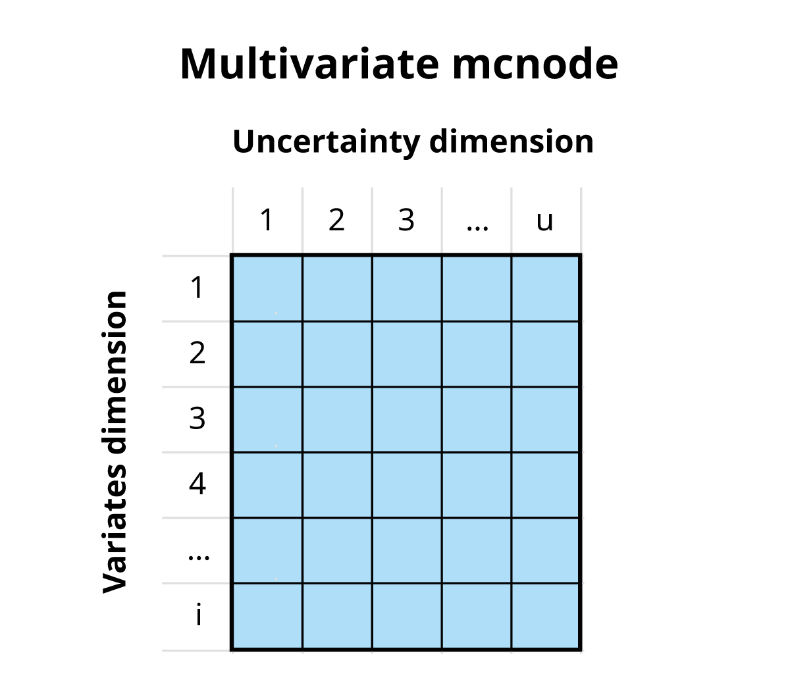
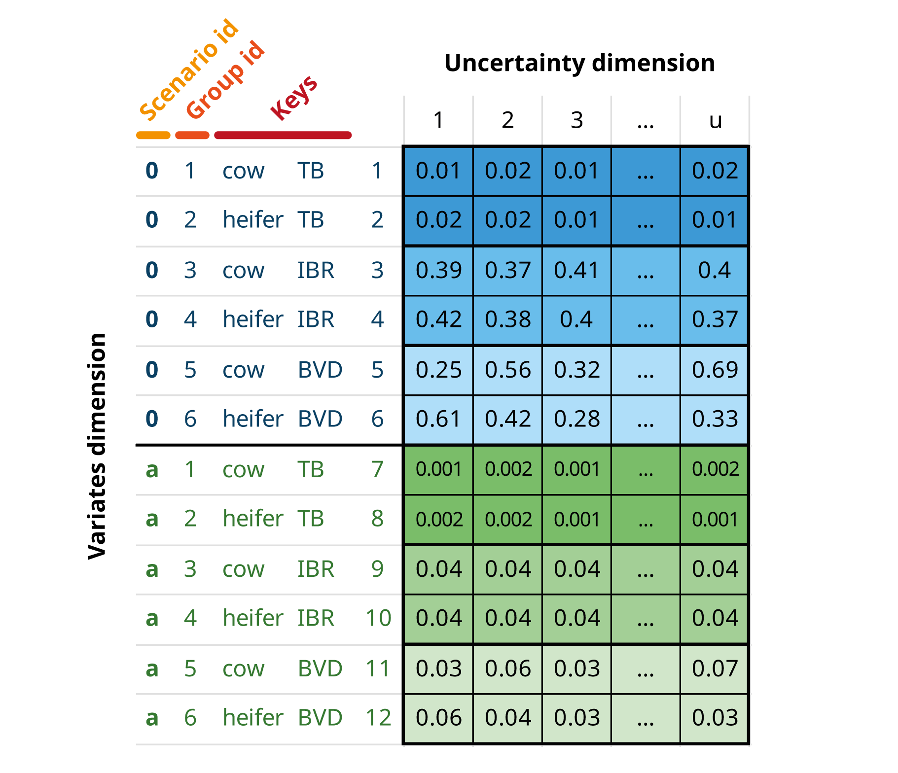

```{r, include = FALSE}
knitr::opts_chunk$set(
  collapse = TRUE,
  comment = "#>"
)
```

```{r setup}
library(mcmodule)
```

## Expressions

## Data

## Nodes

### Input nodes

### Nodes metadata

## Modules

### Structure

### Modules metadata

# Introduction

This guide presents a flexible approach for building risk assessment models with Monte Carlo simulations in R. The framework is **multivariate**, allowing simultaneous analysis of multiple variates (different categories or groups), and **modular,** breaking complex systems into manageable components.

The `mc2d` R package [@mc2d] provides tools to build and analyse models involving multiple variables and uncertainties based on Monte Carlo simulations. However, these tools are limited when handling multiple variates, and complex models can be difficult to analyse and interpret. The `mcmodule` package builds on the R package mc2d to enhance model flexibility. This new package provides:

1.  Tools to add metadata to model elements for better traceability and debugging
2.  Tools to handle complex multivariate variables
3.  A framework to break down Monte Carlo models into smaller, reusable components (modules) that can be analysed independently before integration

# Multivariate Monte-Carlo simulations

| *This section draws from the [mc2d](https://cran.r-project.org/package=mc2d) package vignette, with adaptations for modular Monte Carlo simulations.*

Quantitative risk analysis is the numerical assessment of risk to facilitate decision making in the face of uncertainty. Monte Carlo simulation is a technique used to model and analyse uncertainty [@Vose2008]. In typical two-dimensional Monte Carlo simulation, one dimension represents variability and the other represents uncertainty. However, in this framework, we take a different approach where:

-   We combine **variability** and **uncertainty** into one dimension (***u***)

-   We use **variates** (representing different groups or categories) in the other dimension (***i***)

This approach enables us to track multiple values across groups simultaneously using variates and to handle cases where values must be aggregated by animal movements, farms, or other grouped entities. Although it would be technically possible to separate variability and uncertainty, the exponential increase in computational and programming requirements would make it impractical in models of this size.

In this framework, an mcnode is an array of **dimensions (*u* × 1 × *i*)**, where u is the dimension of variability and uncertainty combined, and i is the number of variates. As most of the input parameters are uncertain, we will use the term "uncertainty dimension" throughout this document to refer to the combined dimension of variability and uncertainty.

{fig-align="center" style="display: block; margin: 1em auto" width="40%"}

For example, if we are buying a number of cows and heifers from a specific region, a mcnode for herd prevalence would have:

-   Multiple variates (rows), each representing a specific animal category-disease combination. The variables that define and distinguish these variates are called **keys**.

-   Probability values generated through a PERT distribution (rpert), using minimum, mode, and maximum parameters across *u* iterations (columns) to model the uncertainty in these estimates.

{fig-align="center" style="display: block; margin: 1em auto" width="85%"}

## Scenarios

This framework enables the creation and comparison of scenarios. For comparisons, you need a baseline scenario (scenario "0") and one or more alternative scenarios. Variates within a scenario are called "groups." While not every scenario needs to contain all baseline groups, any groups present in alternative scenarios must exist in the baseline.

The scenario id, group id, and row number are the three mcnode properties that enable row matching and row aggregation operations.

{fig-align="center" style="display: block; margin: 1em auto" width="70%"}
