```{r, include = FALSE}
knitr::opts_chunk$set(
  collapse = TRUE,
  comment = "#>"
)
```

```{r setup, include = FALSE}
library(mcmodule)
```

> *Work in progress!* 🏗

# Element-wise operations {#sec-element-wise-operations}

Most operations in this model are element-wise, meaning each calculation occurs independently on matching elements across nodes. These operations preserve node dimensions while applying functions (such as multiplication or addition) to corresponding elements, allowing uncertainties and variates to propagate through the calculations.

{fig-align="center" style="display: block; margin: 1em auto" width="100%"}

# Row matching {#sec-row-matching}

Row matching operations align nodes to ensure they have compatible dimensions and properly matched rows for element-wise calculations. This is especially important when working with nodes containing different scenarios. The matching process may require reordering, duplicating, or adding rows to either or both nodes.

Row matching between nodes is needed in the following cases and their combinations:

## Group matching

Nodes with same scenarios/dimensions but different group order

1.  Check if keys that define groups are in a different order

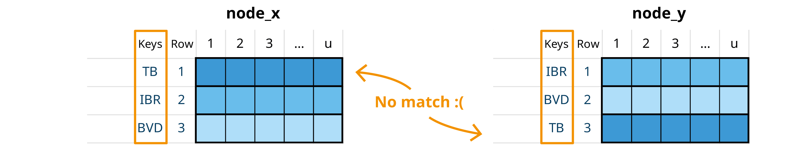{fig-align="center" style="display: block; margin: 1em auto" width="100%"}

2.  Assign common group ids, based on keys

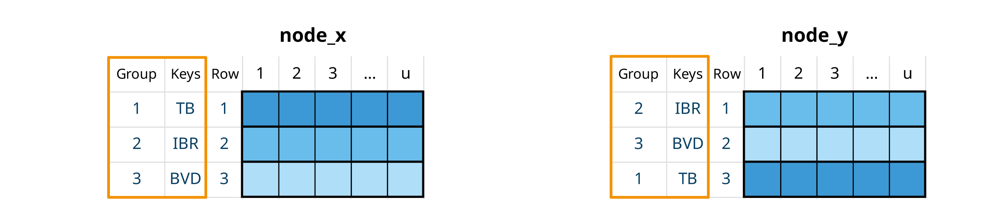{fig-align="center" style="display: block; margin: 1em auto" width="100%"}

3.  Reorder rows to align group ids. This is similar to dplyr `left_join`

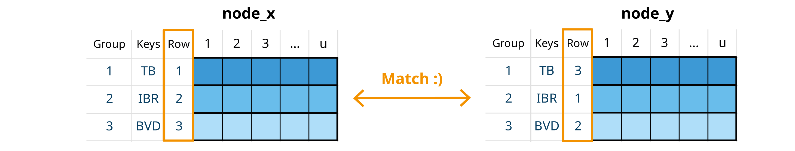{fig-align="center" style="display: block; margin: 1em auto" width="100%"}

## Scenario matching

Nodes with same groups but different scenarios. The general rule for these operations is that when no scenario is specified, it is assumed that a variable takes the values from the baseline scenario.

1.  Check if scenarios are different

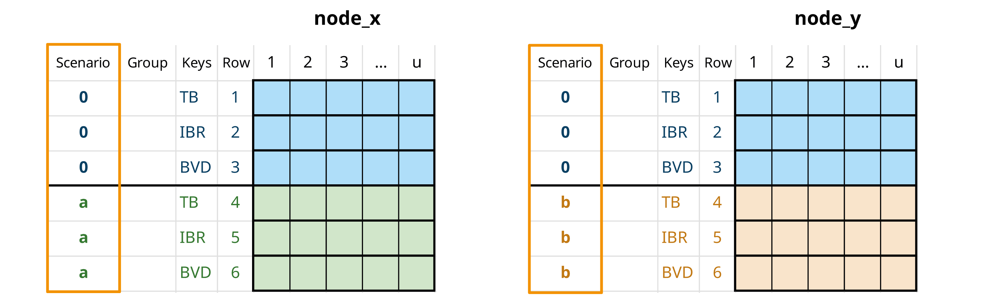{fig-align="center" style="display: block; margin: 1em auto" width="100%"}

2.  For missing scenarios, duplicate the baseline scenario (scenario "0")

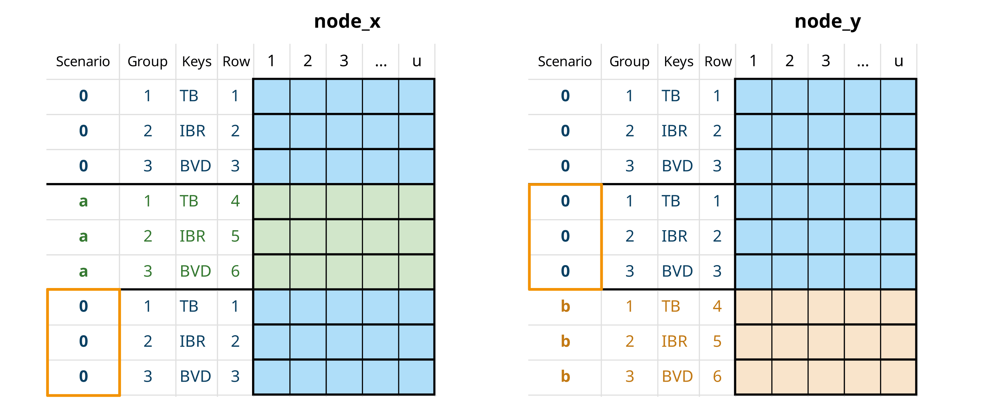{fig-align="center" style="display: block; margin: 1em auto" width="100%"}

3.  When nodes matched by scenario are used in an element-wise operation, the resulting node will contain all scenarios from both input nodes. This is conceptually similar to a dplyr `full_join`, except that any unmatched rows use values from the baseline scenario.

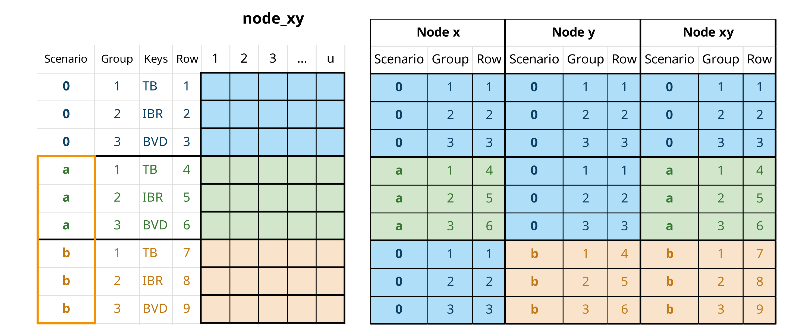{fig-align="center" style="display: block; margin: 1em auto" width="100%"}

## Null matching

When nodes contain different scenarios and groups, some groups may be missing from certain nodes. These missing groups (called "null" variates) are assigned a probability of 0. This operation typically complements scenario matching.

1.  Check for missing groups

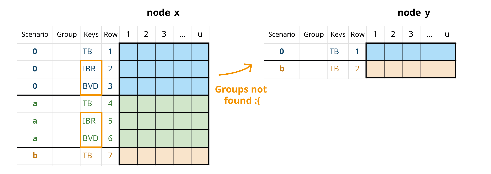{fig-align="center" style="display: block; margin: 1em auto" width="100%"}

2.  Add null variates with probability 0 for any missing groups (and apply scenario matching)

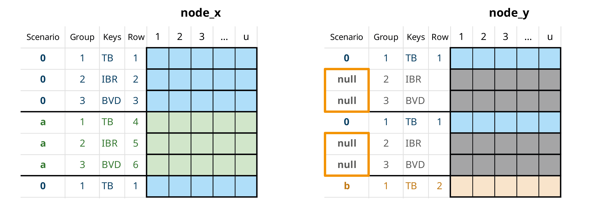{fig-align="center" style="display: block; margin: 1em auto" width="100%"}

1.  When nodes are matched by scenario in an element-wise operation, the resulting node will contain all groups from both input nodes

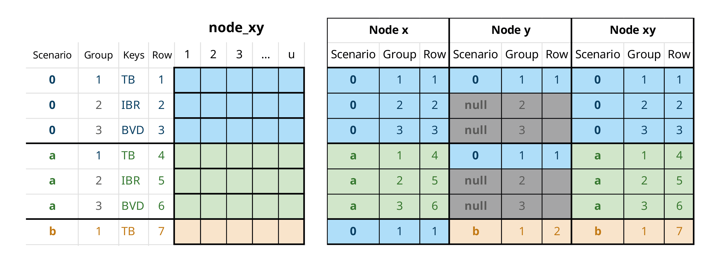{fig-align="center" style="display: block; margin: 1em auto" width="100%"}

# Combined probabilities

A special type of element-wise operation that automatically deals with row matching. Combines probabilities of multiple events assuming independence, using the formula:

$$ P(A \cup B) = 1 - (1-P(A))(1-P(B))$$

# Row aggregation {#sec-row-aggregation}

Row aggregation operations combine values across multiple rows (variates) in an mcnode using specific criteria. These operations calculate overall probabilities or sum quantities across groups.

## Probabilities

Some events can occur independently across multiple variates of the same node. For example, a disease might be present in animals from different regions or farms. To calculate the probability of an **event occurring in at least one variate** within a subset, we first group the data by aggregation keys (*agg_keys*). Then, for each subset, we use the standard probability formula for independent trials to find the probability of the event occurring in at least one variate.

$$
p\_{agg}=1-\prod_{p\subseteq S}(1-p)
$$

Where:

-   *S* represents the subset of variates included in the aggregation

-   *p* represents the probability of an event occurring

-   *p_agg* represents the probability of occurrence in at least one variate of S

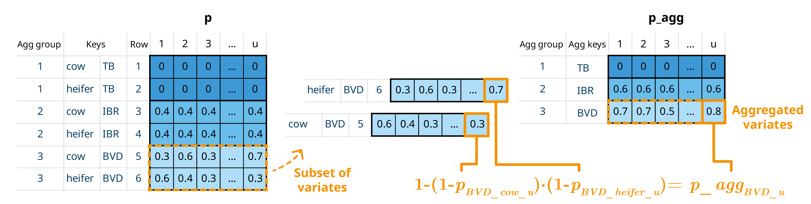{fig-align="center" style="display: block; margin: 1em auto" width="100%"}

If scenarios are being simulated, scenario id must always be included as an aggregation key, as probabilities are not calculated across different what-if scenarios.

You can also keep all variariates, with their corresponding aggregated values, to ensure dimensions compatibility in further calculations.

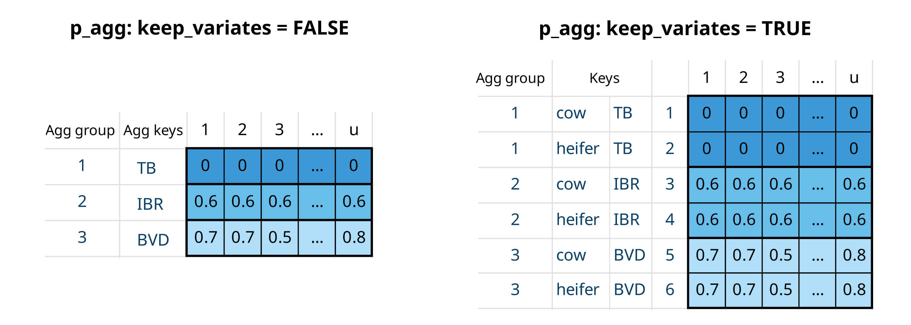{fig-align="center" style="display: block; margin: 1em auto" width="80%"}

## Quantities

When working with quantities (such as number of animals or farms), we calculate totals by summing values across variates within each subset.

$$ n\_{agg}=\sum_{n\subseteq S} n $$

Where:

-   *S* represents the subset of variates included in the aggregation

-   *n* represents the quantity value

-   *n_agg* represents the sum of quantities across all variates in *S*

# Trials

In this framework, nodes typically represent the probability of **success for a** **single trial with a binary outcome** (success/failure). A trial is one instance where an event might occur, for example, an animal, farm, batch, animal movement, or farm visit. Each trial has two possible outcomes, such as whether an animal is infected or not, or whether a test is positive or negative. In **single-level** trials, all trials are independent and have the same probability of success[^1].

[^1]: In this context, a "success" refers to the occurrence of an event of interest, which may actually represent an undesirable outcome such as the presence of a disease or a positive test result for a pathogen.

Some probability processes follow a hierarchical structure where events occur at different levels. For example, when animals are purchased from multiple farms, we must consider both the probability of a farm being infected and the probability of an individual animal within that farm being infected. This means infection probabilities for animals from the same farm are not independent. In **multilevel** trials, trials are organized into subsets, with each subset having its own selection probability. A subset represents a group sharing specific characteristics, for example, animals from the same farm or with the same health status.

Most of the following probability processes and calculations are based on Chapter 5 of the *Handbook on Import Risk Analysis for Animals and Animal Products Volume 2. Quantitative risk assessment* [@Murray2004].

## Single-level trials

In single-level trials, each trial is independent with the same probability of success ($trial\_p$). For a set of $trials\_n$ trials, the probability of at least one success is:

$$ set\_p= 1-(1-trial\_p)^{trials\_n} $$

In `imports_mcmodule`, we have the probability that an infected animal from an infected farm goes undetected ($no\_detect\_a$). When all animals (in a variate) have the same probability, we can use the total number of animals selected per farm ($animals\_n$) as the number of trials (`trials_n`) to determine the probability that at least one infected animal from one farm is not detected ($no\_detect\_set$). Note that while $animals\_n$ isn't defined as an mcnode in `imports_mcmodule` (not used in `imports_mcmodule$model_exp`), it can be automatically generated in `trial_totals()` because it's included in `imports_mctable` and the required data exists in `imports_mcmodule$data`.

```{r}
# Single-level trial
imports_mcmodule <- trial_totals(
  mcmodule = imports_mcmodule,
  mc_names = "no_detect_a", # trial_p
  trials_n = "animals_n",
  mctable = imports_mctable
)

# Probability that at least one infected animal from an infected farm is not detected
mc_summary(imports_mcmodule,"no_detect_a_set")[,-1]
```

## Multilevel trials

## Simple multilevel

In multilevel trials, we account for hierarchical structures where trials are organized into subsets. For example, when considering animals ($trials\_n$) from different farms ($subset\_n$), we must account for both the farm's selection probability ($subset\_p$) and the individual animal's probability of success ($trial\_p$).

The probability of at least one success in this hierarchical structure is given by:

$$ set\_p= 1-(1-subset\_p \cdot (1-(1-trial\_p)^{trial\_n}))^{subset\_n}  $$

Where:

-   *trials_p* represents the probability of a trial in a subset being a success

-   *trials_n* represents the number of trials in subset

-   *subset_p* represents the probability of a subset being selected

-   *subset_n* represents the number of subsets

-   *set_p* represents the probability of a at least one trial of at least one subsetbeing a success

When considering animals (`trials_n`) from different farms (`subset_n`, we must account for both the farm’s probability of being infected (`subsets_p`) and the individual animal’s probability of being infected (`trial_p`).

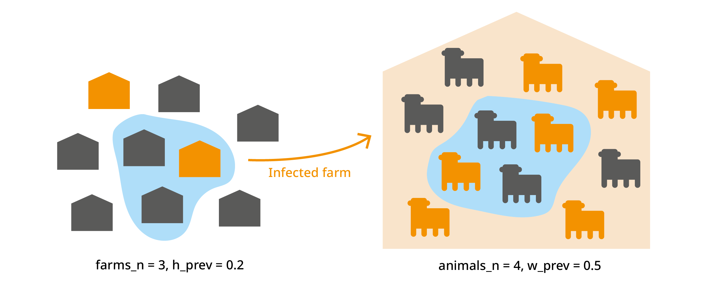

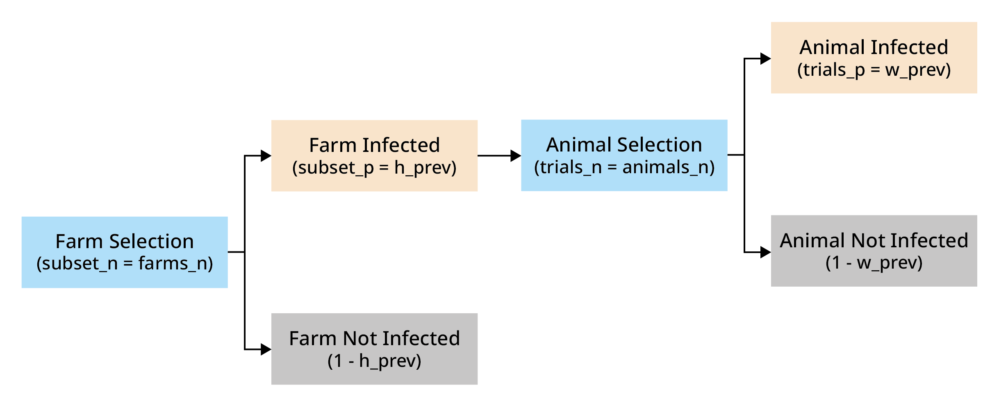

```{r}
# Simple multilevel trial
imports_mcmodule <- trial_totals(
  mcmodule = imports_mcmodule,
  mc_names = "no_detect_a", # trial_p
  trials_n = "animals_n",
  subsets_n = "farms_n",
  subsets_p = "h_prev",
  mctable = imports_mctable
)

# Probability that at least one infected animal from at least one farm is not detected
mc_summary(imports_mcmodule,"no_detect_a_set", digits=2)[,-1]

```

## Multiple group multilevel trials

In multiple group multilevel trials, several variates (groups) can belong to the same subset. For example, when selecting animals of different categories (cow, calf, heifer, bull) from the same farm, their infection probabilities are not independent. You should include aggregation keys for groups that are not independent to calculate their trial probabilities, for example, aggregating variates for different animal categories by farm. For this calculation, the subset_p and subset_n values must be identical across all variates being aggregated.

$$
trial\_p\_agg=1-\prod_{trial\_p\subseteq S}(1-trial\_p)^{trial\_n}
$$

$$ set\_p\_agg = 1-(1-subset\_p \cdot trial\_p\_agg)^{subset\_n}  $$

Where:

-   S represents the variates included in the aggregation

-   *trials_p* represents the probability of success of a trial in a subset

-   *trials_n* represents the number of trials in subset

-   *trials_p* *\_agg* represents the probability of success of at least one variate in at least one of the aggregated variates

-   *subset_p* represents the probability of a subset being selected

-   *subset_n* represents the number of subsets

-   *set_p_agg* represents the probability of success of a at least one trial in at least one of the aggregated variates in at least one subset

As with row aggregation, you can keep all variates to maintain dimensions compatibility in further calculations.


